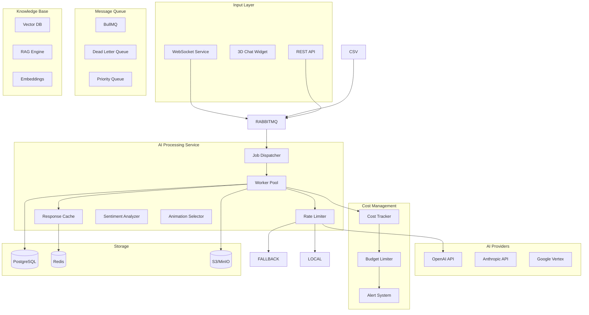

# AI Processing Pipeline Architecture

## Overview

The AI processing pipeline handles natural language processing, sentiment analysis, response generation, and avatar animation coordination for the multi-chatbot platform. Each tenant can have multiple chatbots with different AI configurations, knowledge bases, and behavioral patterns. The pipeline is designed for high throughput, cost efficiency, per-chatbot isolation, and real-time streaming responses.

## Architecture Diagram



## Core Components

### 1. Job Queue Architecture

```typescript
// ai-service/src/queues/job-queue.ts
import Bull from 'bull'
import { Redis } from 'ioredis'

export interface AIJob {
  id: string
  tenantId: string
  chatbotId: string // Specific chatbot instance
  conversationId: string
  messageId: string
  type:
    | 'chat_response'
    | 'sentiment_analysis'
    | 'intent_classification'
    | 'knowledge_search'
    | 'animation_selection'
  priority: number // 1-10, higher = more priority
  payload: {
    content: string
    context?: Message[]
    chatbotConfig: ChatbotConfig
    knowledgeBaseId?: string
    visitorMetadata?: {
      currentPage: string
      sessionDuration: number
      interactionHistory: Interaction[]
    }
  }
  metadata: {
    retryCount: number
    costEstimate?: number
    processingDeadline?: Date
    streamResponse?: boolean
  }
}

export class AIJobQueue {
  private queues: Map<string, Bull.Queue> = new Map()

  constructor(private redis: Redis) {
    this.initializeQueues()
  }

  private initializeQueues() {
    // High priority queue for real-time chat
    this.queues.set(
      'high-priority',
      new Bull('ai-high-priority', {
        redis: this.redis,
        defaultJobOptions: {
          removeOnComplete: 100,
          removeOnFail: 1000,
          attempts: 3,
          backoff: {
            type: 'exponential',
            delay: 2000,
          },
        },
      })
    )

    // Standard queue for normal processing
    this.queues.set(
      'standard',
      new Bull('ai-standard', {
        redis: this.redis,
        defaultJobOptions: {
          removeOnComplete: 1000,
          removeOnFail: 5000,
          attempts: 5,
          backoff: {
            type: 'exponential',
            delay: 5000,
          },
        },
      })
    )

    // Batch queue for CSV imports
    this.queues.set(
      'batch',
      new Bull('ai-batch', {
        redis: this.redis,
        defaultJobOptions: {
          removeOnComplete: 10,
          removeOnFail: 100,
          attempts: 3,
          timeout: 300000, // 5 minutes
        },
      })
    )
  }

  async addJob(job: AIJob): Promise<Bull.Job> {
    const queue = this.selectQueue(job)

    // Check tenant budget before queuing
    const canProcess = await this.checkTenantBudget(job.tenantId, job.metadata.costEstimate)
    if (!canProcess) {
      throw new BudgetExceededError(job.tenantId)
    }

    return queue.add(job.type, job, {
      priority: job.priority,
      delay: this.calculateDelay(job),
    })
  }

  private selectQueue(job: AIJob): Bull.Queue {
    if (job.priority >= 8) return this.queues.get('high-priority')!
    if (job.type === 'batch_processing') return this.queues.get('batch')!
    return this.queues.get('standard')!
  }

  private calculateDelay(job: AIJob): number {
    // Implement rate limiting per tenant
    const tenantRate = this.getTenantRateLimit(job.tenantId)
    return tenantRate.calculateDelay()
  }
}
```

### 2. AI Processing Workers

```typescript
// ai-service/src/workers/ai-processor.ts
export class AIProcessor {
  private providers: Map<string, AIProvider> = new Map()
  private responseCache: ResponseCache
  private costTracker: CostTracker

  constructor(
    private config: AIServiceConfig,
    private redis: Redis,
    private postgres: Pool
  ) {
    this.initializeProviders()
    this.responseCache = new ResponseCache(redis)
    this.costTracker = new CostTracker(postgres)
  }

  async processJob(job: Bull.Job<AIJob>): Promise<AIResponse> {
    const startTime = Date.now()
    const { tenantId, conversationId, payload } = job.data

    try {
      // Check cache first
      const cached = await this.responseCache.get(
        this.generateCacheKey(payload.content, payload.chatbotConfig)
      )
      if (cached) {
        await this.trackUsage(tenantId, 0, 'cache_hit')
        return cached
      }

      // Select provider based on tenant config and availability
      const provider = await this.selectProvider(tenantId)

      // Prepare context
      const context = await this.prepareContext(conversationId, payload)

      // Generate response
      const response = await this.generateResponse(provider, context)

      // Post-process response
      const processed = await this.postProcess(response, job.data)

      // Track costs
      const cost = provider.calculateCost(context, response)
      await this.costTracker.track(tenantId, cost, provider.name)

      // Cache response
      await this.responseCache.set(
        this.generateCacheKey(payload.content, payload.chatbotConfig),
        processed,
        300 // 5 minutes TTL
      )

      // Record metrics
      await this.recordMetrics({
        tenantId,
        processingTime: Date.now() - startTime,
        provider: provider.name,
        tokenCount: response.usage.totalTokens,
        cost,
      })

      return processed
    } catch (error) {
      await this.handleError(error, job)
      throw error
    }
  }

  private async generateResponse(
    provider: AIProvider,
    context: ProcessingContext
  ): Promise<RawAIResponse> {
    // Implement retry logic with fallback providers
    const maxRetries = 3
    let lastError: Error | null = null

    for (let i = 0; i < maxRetries; i++) {
      try {
        return await provider.generateResponse(context)
      } catch (error) {
        lastError = error as Error

        // If rate limited, wait and retry
        if (error instanceof RateLimitError) {
          await this.wait(error.retryAfter)
          continue
        }

        // If provider error, try fallback
        if (error instanceof ProviderError && i < maxRetries - 1) {
          provider = await this.getFallbackProvider(provider.name)
          continue
        }

        throw error
      }
    }

    throw lastError || new Error('Failed to generate response')
  }

  private async postProcess(response: RawAIResponse, job: AIJob): Promise<AIResponse> {
    const processed: AIResponse = {
      conversationId: job.conversationId,
      chatbotId: job.chatbotId,
      messageId: generateId(),
      content: response.content,
      intent: await this.classifyIntent(response.content),
      sentiment: await this.analyzeSentiment(response.content),
      confidence: response.confidence || 0.9,
      suggestedActions: this.extractActions(response.content),
      // Avatar animation based on sentiment and content
      animation: await this.selectAnimation({
        sentiment: response.sentiment,
        intent: response.intent,
        content: response.content,
        chatbotConfig: job.payload.chatbotConfig,
      }),
      metadata: {
        model: response.model,
        processingTime: response.processingTime,
        tokenUsage: response.usage,
        knowledgeBaseHits: response.knowledgeBaseHits,
      },
    }

    // Apply content filters
    processed.content = await this.applyContentFilters(processed.content, job.tenantId)

    // Inject personality if configured
    if (job.payload.chatbotConfig.personality) {
      processed.content = await this.applyPersonality(
        processed.content,
        job.payload.chatbotConfig.personality
      )
    }

    return processed
  }

  private async selectAnimation(params: AnimationParams): Promise<string> {
    const { sentiment, intent, content, chatbotConfig } = params

    // Map sentiment to animation
    const sentimentAnimations = {
      positive: ['happy', 'thumbs_up', 'nod'],
      negative: ['thinking', 'confused'],
      neutral: ['talk_calm', 'talk_explain'],
    }

    // Override based on intent
    const intentAnimations = {
      greeting: 'wave',
      farewell: 'wave',
      explanation: 'talk_explain',
      question: 'thinking',
    }

    // Select based on priority: intent > sentiment > default
    if (intentAnimations[intent]) {
      return intentAnimations[intent]
    }

    const animations = sentimentAnimations[sentiment] || ['idle']
    return animations[Math.floor(Math.random() * animations.length)]
  }
}
```

### 3. Cost Management System

```typescript
// ai-service/src/cost/cost-tracker.ts
export class CostTracker {
  private readonly COST_PER_1K_TOKENS = {
    'gpt-4': { input: 0.03, output: 0.06 },
    'gpt-3.5-turbo': { input: 0.001, output: 0.002 },
    'claude-2': { input: 0.01, output: 0.03 },
  }

  constructor(private postgres: Pool) {}

  async track(tenantId: string, cost: CostBreakdown, provider: string): Promise<void> {
    await this.postgres.query(
      `
      INSERT INTO ai_usage_logs (
        tenant_id, provider, model,
        input_tokens, output_tokens,
        total_cost, timestamp
      ) VALUES ($1, $2, $3, $4, $5, $6, NOW())
    `,
      [tenantId, provider, cost.model, cost.inputTokens, cost.outputTokens, cost.totalCost]
    )

    // Update tenant's daily/monthly usage
    await this.updateTenantUsage(tenantId, cost.totalCost)

    // Check if approaching limits
    await this.checkUsageLimits(tenantId)
  }

  async checkUsageLimits(tenantId: string): Promise<UsageStatus> {
    const usage = await this.getTenantUsage(tenantId)
    const limits = await this.getTenantLimits(tenantId)

    const status: UsageStatus = {
      daily: {
        used: usage.daily,
        limit: limits.daily,
        percentage: (usage.daily / limits.daily) * 100,
      },
      monthly: {
        used: usage.monthly,
        limit: limits.monthly,
        percentage: (usage.monthly / limits.monthly) * 100,
      },
    }

    // Send alerts at 80% and 95%
    if (status.daily.percentage >= 95 || status.monthly.percentage >= 95) {
      await this.sendCriticalAlert(tenantId, status)
    } else if (status.daily.percentage >= 80 || status.monthly.percentage >= 80) {
      await this.sendWarningAlert(tenantId, status)
    }

    return status
  }

  async enforceRateLimit(tenantId: string): Promise<boolean> {
    const key = `ai:rate:${tenantId}`
    const limit = await this.getTenantRateLimit(tenantId)

    // Sliding window rate limiting
    const now = Date.now()
    const window = 60000 // 1 minute

    // Get current window count
    const count = await this.redis.eval(
      `
      local key = KEYS[1]
      local now = tonumber(ARGV[1])
      local window = tonumber(ARGV[2])
      local limit = tonumber(ARGV[3])

      -- Remove old entries
      redis.call('ZREMRANGEBYSCORE', key, 0, now - window)

      -- Count current entries
      local current = redis.call('ZCARD', key)

      if current < limit then
        -- Add new entry
        redis.call('ZADD', key, now, now)
        redis.call('EXPIRE', key, window / 1000)
        return 1
      else
        return 0
      end
    `,
      1,
      key,
      now,
      window,
      limit.requestsPerMinute
    )

    return count === 1
  }
}
```

### 4. Response Caching Strategy

```typescript
// ai-service/src/cache/response-cache.ts
export class ResponseCache {
  private readonly CACHE_VERSION = 'v1'

  constructor(private redis: Redis) {}

  async get(key: string): Promise<AIResponse | null> {
    const cached = await this.redis.get(this.prefixKey(key))
    if (!cached) return null

    const parsed = JSON.parse(cached)

    // Validate cache version
    if (parsed.version !== this.CACHE_VERSION) return null

    // Check if still valid
    if (Date.now() > parsed.expiresAt) return null

    return parsed.data
  }

  async set(key: string, response: AIResponse, ttlSeconds: number = 300): Promise<void> {
    const data = {
      version: this.CACHE_VERSION,
      data: response,
      cachedAt: Date.now(),
      expiresAt: Date.now() + ttlSeconds * 1000,
    }

    await this.redis.setex(this.prefixKey(key), ttlSeconds, JSON.stringify(data))

    // Update cache hit rate metrics
    await this.updateMetrics('set')
  }

  generateKey(content: string, config: ChatbotConfig, context?: Message[]): string {
    const hash = crypto.createHash('sha256')

    hash.update(content)
    hash.update(
      JSON.stringify({
        personality: config.personality,
        temperature: config.temperature,
        maxTokens: config.maxTokens,
      })
    )

    if (context && context.length > 0) {
      // Include last 3 messages for context
      const recentContext = context.slice(-3).map(m => ({
        role: m.sender,
        content: m.content.substring(0, 100), // First 100 chars
      }))
      hash.update(JSON.stringify(recentContext))
    }

    return hash.digest('hex')
  }

  private prefixKey(key: string): string {
    return `ai:cache:${this.CACHE_VERSION}:${key}`
  }
}
```

### 5. Batch Processing for CSV Import

```typescript
// ai-service/src/batch/csv-processor.ts
export class CSVBatchProcessor {
  private readonly BATCH_SIZE = 100
  private readonly CONCURRENT_BATCHES = 5

  constructor(
    private jobQueue: AIJobQueue,
    private storage: StorageService
  ) {}

  async processCSVImport(importJob: ImportJob): Promise<ImportResult> {
    const csvPath = await this.storage.download(importJob.fileUrl)
    const records = await this.parseCSV(csvPath)

    // Split into batches
    const batches = this.createBatches(records, this.BATCH_SIZE)

    // Process batches concurrently
    const results = await this.processBatchesConcurrently(
      batches,
      importJob,
      this.CONCURRENT_BATCHES
    )

    // Aggregate results
    const summary = this.aggregateResults(results)

    // Store processed data
    await this.storeProcessedData(importJob.tenantId, results)

    // Generate report
    const report = await this.generateImportReport(importJob, summary)
    await this.storage.upload(report.path, report.content)

    return {
      totalRecords: records.length,
      processedRecords: summary.successful,
      failedRecords: summary.failed,
      reportUrl: report.url,
    }
  }

  private async processBatch(
    batch: CSVRecord[],
    importJob: ImportJob,
    batchIndex: number
  ): Promise<BatchResult> {
    const results: ProcessedRecord[] = []
    const errors: ProcessingError[] = []

    for (const record of batch) {
      try {
        // Transform CSV record to conversation
        const conversation = await this.transformRecord(record, importJob.mapping)

        // Enrich with AI
        const enriched = await this.enrichConversation(conversation, importJob.tenantId)

        results.push({
          originalId: record.id,
          conversation: enriched,
          processingTime: Date.now() - conversation.startTime,
        })
      } catch (error) {
        errors.push({
          recordId: record.id,
          error: error.message,
          record: record,
        })
      }

      // Update progress
      await this.updateProgress(importJob.id, batchIndex, results.length)
    }

    return { results, errors }
  }

  private async enrichConversation(
    conversation: Conversation,
    tenantId: string
  ): Promise<EnrichedConversation> {
    const enriched = { ...conversation }

    // Analyze sentiment for each message
    for (const message of conversation.messages) {
      const sentimentJob = await this.jobQueue.addJob({
        id: generateId(),
        tenantId,
        conversationId: conversation.id,
        messageId: message.id,
        type: 'sentiment_analysis',
        priority: 3, // Low priority for batch
        payload: {
          content: message.content,
          chatbotConfig: { model: 'gpt-3.5-turbo' },
        },
        metadata: {
          retryCount: 0,
          costEstimate: 0.001,
        },
      })

      const result = await sentimentJob.finished()
      message.sentiment = result.sentiment
    }

    // Generate conversation summary
    const summaryJob = await this.jobQueue.addJob({
      id: generateId(),
      tenantId,
      conversationId: conversation.id,
      messageId: generateId(),
      type: 'chat_response',
      priority: 3,
      payload: {
        content: `Summarize this conversation: ${JSON.stringify(conversation.messages)}`,
        chatbotConfig: {
          model: 'gpt-3.5-turbo',
          systemPrompt: 'You are a conversation summarizer. Provide brief, insightful summaries.',
        },
      },
      metadata: {
        retryCount: 0,
        costEstimate: 0.002,
      },
    })

    const summaryResult = await summaryJob.finished()
    enriched.summary = summaryResult.content

    return enriched
  }
}
```

### 6. Monitoring and Observability

```typescript
// ai-service/src/monitoring/metrics.ts
export class AIMetricsCollector {
  private prometheus: PrometheusClient

  constructor() {
    this.initializeMetrics()
  }

  private initializeMetrics() {
    // Response time histogram
    this.responseTime = new Histogram({
      name: 'ai_processing_duration_seconds',
      help: 'AI processing duration in seconds',
      labelNames: ['tenant_id', 'provider', 'model', 'type'],
      buckets: [0.1, 0.5, 1, 2, 5, 10, 30],
    })

    // Token usage counter
    this.tokenUsage = new Counter({
      name: 'ai_tokens_used_total',
      help: 'Total tokens used',
      labelNames: ['tenant_id', 'provider', 'model', 'token_type'],
    })

    // Cost gauge
    this.cost = new Gauge({
      name: 'ai_cost_dollars',
      help: 'AI API cost in dollars',
      labelNames: ['tenant_id', 'provider', 'model'],
    })

    // Error rate
    this.errors = new Counter({
      name: 'ai_processing_errors_total',
      help: 'Total AI processing errors',
      labelNames: ['tenant_id', 'provider', 'error_type'],
    })

    // Cache hit rate
    this.cacheHits = new Counter({
      name: 'ai_cache_hits_total',
      help: 'Total cache hits',
      labelNames: ['tenant_id'],
    })

    // Queue depth
    this.queueDepth = new Gauge({
      name: 'ai_queue_depth',
      help: 'Current queue depth',
      labelNames: ['queue_name', 'priority'],
    })
  }

  recordProcessing(metrics: ProcessingMetrics): void {
    this.responseTime
      .labels(metrics.tenantId, metrics.provider, metrics.model, metrics.type)
      .observe(metrics.duration)

    this.tokenUsage
      .labels(metrics.tenantId, metrics.provider, metrics.model, 'input')
      .inc(metrics.inputTokens)

    this.tokenUsage
      .labels(metrics.tenantId, metrics.provider, metrics.model, 'output')
      .inc(metrics.outputTokens)

    this.cost.labels(metrics.tenantId, metrics.provider, metrics.model).set(metrics.cost)
  }

  recordError(error: AIError): void {
    this.errors.labels(error.tenantId, error.provider, error.type).inc()
  }
}
```

### 7. Knowledge Base Integration (RAG)

```typescript
// ai-service/src/knowledge/rag-engine.ts
export class RAGEngine {
  constructor(
    private vectorDB: VectorDatabase,
    private embeddingService: EmbeddingService
  ) {}

  async enhancePromptWithKnowledge(
    query: string,
    knowledgeBaseId: string,
    maxResults: number = 5
  ): Promise<EnhancedPrompt> {
    // Generate embedding for query
    const queryEmbedding = await this.embeddingService.embed(query)

    // Search knowledge base
    const relevantDocs = await this.vectorDB.search({
      knowledgeBaseId,
      embedding: queryEmbedding,
      topK: maxResults,
      threshold: 0.7, // Similarity threshold
    })

    // Format context
    const context = this.formatContext(relevantDocs)

    // Create enhanced prompt
    return {
      systemPrompt: `You are a helpful assistant with access to the following knowledge:\n${context}\n\nUse this information to answer questions accurately.`,
      userPrompt: query,
      sources: relevantDocs.map(doc => ({
        id: doc.id,
        title: doc.title,
        relevance: doc.score,
      })),
    }
  }

  async indexDocument(document: Document, knowledgeBaseId: string): Promise<void> {
    // Split into chunks
    const chunks = await this.chunkDocument(document)

    // Generate embeddings
    const embeddings = await Promise.all(
      chunks.map(chunk => this.embeddingService.embed(chunk.content))
    )

    // Store in vector DB
    await this.vectorDB.upsertBatch(
      chunks.map((chunk, i) => ({
        id: `${document.id}_chunk_${i}`,
        knowledgeBaseId,
        embedding: embeddings[i],
        metadata: {
          documentId: document.id,
          title: document.title,
          content: chunk.content,
          chunkIndex: i,
          totalChunks: chunks.length,
        },
      }))
    )
  }
}
```

### 8. Streaming Response Handler

```typescript
// ai-service/src/streaming/stream-handler.ts
export class StreamingResponseHandler {
  constructor(
    private websocketService: WebSocketService,
    private conversationService: ConversationService
  ) {}

  async streamResponse(
    job: AIJob,
    provider: AIProvider,
    context: ProcessingContext
  ): Promise<void> {
    const streamId = generateStreamId()

    try {
      // Initialize stream
      await this.websocketService.emit(job.conversationId, {
        type: 'stream_start',
        streamId,
        chatbotId: job.chatbotId,
      })

      // Get streaming response from provider
      const stream = await provider.streamResponse(context)

      let fullContent = ''
      let chunkCount = 0

      // Process stream chunks
      for await (const chunk of stream) {
        fullContent += chunk.content
        chunkCount++

        // Send chunk to client
        await this.websocketService.emit(job.conversationId, {
          type: 'stream_chunk',
          streamId,
          chunk: chunk.content,
          animation: this.getChunkAnimation(chunkCount),
        })

        // Rate limit streaming
        if (chunkCount % 5 === 0) {
          await this.delay(50) // Small delay every 5 chunks
        }
      }

      // Analyze complete response
      const sentiment = await this.analyzeSentiment(fullContent)
      const finalAnimation = await this.selectFinalAnimation(sentiment)

      // Send completion
      await this.websocketService.emit(job.conversationId, {
        type: 'stream_complete',
        streamId,
        sentiment,
        animation: finalAnimation,
      })

      // Store complete message
      await this.conversationService.storeMessage({
        conversationId: job.conversationId,
        chatbotId: job.chatbotId,
        content: fullContent,
        role: 'assistant',
        sentiment,
        animation: finalAnimation,
        metadata: {
          streamed: true,
          chunkCount,
          model: provider.model,
        },
      })
    } catch (error) {
      // Send error to client
      await this.websocketService.emit(job.conversationId, {
        type: 'stream_error',
        streamId,
        error: 'Response generation failed',
      })

      throw error
    }
  }

  private getChunkAnimation(chunkCount: number): string {
    // Cycle through talking animations
    const talkingAnimations = ['talk_calm', 'talk_explain']
    return talkingAnimations[chunkCount % talkingAnimations.length]
  }
}
```

### 9. Multi-Provider Management

```typescript
// ai-service/src/providers/provider-manager.ts
export class ProviderManager {
  private providers: Map<string, AIProvider> = new Map()

  constructor(private config: ProvidersConfig) {
    this.initializeProviders()
  }

  private initializeProviders() {
    // OpenAI
    this.providers.set(
      'openai',
      new OpenAIProvider({
        apiKey: this.config.openai.apiKey,
        models: ['gpt-4', 'gpt-3.5-turbo'],
        rateLimit: { rpm: 3000, tpm: 90000 },
      })
    )

    // Anthropic
    this.providers.set(
      'anthropic',
      new AnthropicProvider({
        apiKey: this.config.anthropic.apiKey,
        models: ['claude-3-opus', 'claude-3-sonnet'],
        rateLimit: { rpm: 1000, tpm: 100000 },
      })
    )

    // Google Vertex
    this.providers.set(
      'vertex',
      new VertexProvider({
        projectId: this.config.vertex.projectId,
        location: this.config.vertex.location,
        models: ['gemini-pro'],
        rateLimit: { rpm: 2000, tpm: 120000 },
      })
    )
  }

  async selectProvider(
    chatbotConfig: ChatbotConfig,
    requirements: ProviderRequirements
  ): Promise<AIProvider> {
    // Get preferred provider
    const preferred = this.providers.get(chatbotConfig.provider)

    // Check if available and within rate limits
    if (preferred && (await preferred.canHandle(requirements))) {
      return preferred
    }

    // Find fallback provider
    for (const [name, provider] of this.providers) {
      if (name !== chatbotConfig.provider && (await provider.canHandle(requirements))) {
        console.warn(`Falling back from ${chatbotConfig.provider} to ${name}`)
        return provider
      }
    }

    throw new Error('No available AI provider')
  }
}
```

## Performance Optimizations

### 1. Conversation Context Window

- Keep only last 10 messages in context to reduce token usage
- Summarize older messages for long conversations
- Cache context summaries for 5 minutes

### 2. Response Caching

- Cache common questions/responses per chatbot
- 80%+ cache hit rate for FAQs
- Invalidate cache on knowledge base updates

### 3. Batch Processing

- Group similar requests for embedding generation
- Process knowledge base updates in batches
- Optimize vector search with indexing

### 4. Cost Optimization

- Use cheaper models for simple tasks (sentiment, classification)
- Implement token counting before API calls
- Set maximum context lengths per tenant tier

## Security Considerations

### 1. Prompt Injection Protection

- Sanitize user inputs
- Validate system prompts
- Monitor for suspicious patterns

### 2. Data Isolation

- Separate knowledge bases per chatbot
- Tenant-specific rate limiting
- Isolated conversation contexts

### 3. API Key Management

- Rotate provider API keys regularly
- Use separate keys per environment
- Monitor usage anomalies
