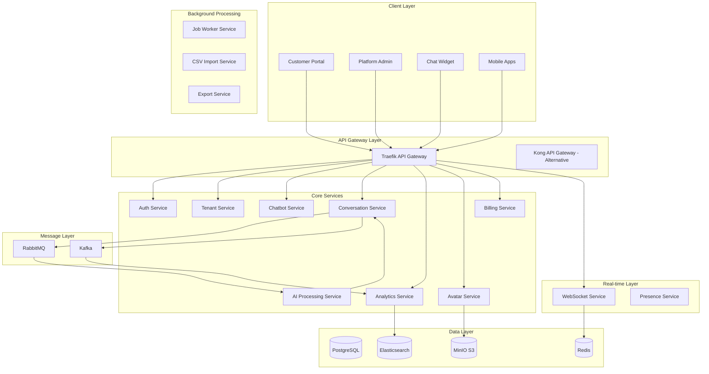

# Microservices Architecture

## Service Topology



## Service Definitions

### 1. Auth Service (Node.js + TypeScript)

**Port**: 3001  
**Responsibilities**:

- JWT token generation and validation
- OAuth2/SAML integration
- Multi-tenant user authentication
- API key management
- Session management via Redis

**Key Endpoints**:

```yaml
POST   /auth/login
POST   /auth/logout
POST   /auth/refresh
GET    /auth/validate
POST   /auth/api-keys
DELETE /auth/api-keys/{id}
```

### 2. Tenant Service (Node.js + TypeScript)

**Port**: 3002  
**Responsibilities**:

- Tenant provisioning and management
- Database isolation and routing
- Subscription management
- Tenant-specific configuration

**Key Endpoints**:

```yaml
POST   /tenants
GET    /tenants/{id}
PUT    /tenants/{id}
POST   /tenants/{id}/provision
PUT    /tenants/{id}/subscription
GET    /tenants/{id}/limits
```

### 3. Chatbot Service (Node.js + TypeScript)

**Port**: 3003  
**Responsibilities**:

- Chatbot CRUD operations
- Deployment key generation
- Configuration management
- Knowledge base management

**Key Endpoints**:

```yaml
GET    /chatbots
POST   /chatbots
GET    /chatbots/{id}
PUT    /chatbots/{id}
DELETE /chatbots/{id}
POST   /chatbots/{id}/deploy
GET    /chatbots/widget/{deploymentKey}
```

### 4. Conversation Service (Node.js + TypeScript)

**Port**: 3004  
**Responsibilities**:

- Conversation lifecycle management
- Message routing and storage
- Real-time message delivery
- Conversation history

**Key Endpoints**:

```yaml
POST   /conversations
GET    /conversations/{id}
POST   /conversations/{id}/messages
GET    /conversations/{id}/messages
PUT    /conversations/{id}/end
GET    /conversations/visitor/{visitorId}
```

### 5. AI Processing Service (Python + FastAPI)

**Port**: 3005  
**Responsibilities**:

- NLP and intent recognition
- Response generation
- Sentiment analysis
- Model management

**Key Endpoints**:

```yaml
POST   /ai/generate-response
POST   /ai/analyze-sentiment
POST   /ai/classify-intent
POST   /ai/extract-entities
GET    /ai/models
PUT    /ai/models/{id}/activate
```

### 6. Analytics Service (Node.js + TypeScript)

**Port**: 3006  
**Responsibilities**:

- Event aggregation
- Metrics calculation
- Report generation
- Real-time dashboards

**Key Endpoints**:

```yaml
GET    /analytics/conversations/summary
GET    /analytics/chatbots/{id}/performance
GET    /analytics/visitors/insights
POST   /analytics/events
GET    /analytics/reports/generate
```

### 7. Avatar Service (Node.js + TypeScript)

**Port**: 3007  
**Responsibilities**:

- 3D model management
- Avatar customization
- Animation controls
- Asset delivery via CDN

**Key Endpoints**:

```yaml
GET    /avatars
POST   /avatars
GET    /avatars/{id}
PUT    /avatars/{id}/customize
GET    /avatars/{id}/animations
POST   /avatars/upload
```

### 8. WebSocket Service (Node.js + Socket.io)

**Port**: 3008  
**Responsibilities**:

- Real-time bidirectional communication
- Connection management
- Message broadcasting
- Presence tracking

**Events**:

```yaml
connection
disconnect
message:send
message:receive
typing:start
typing:stop
conversation:end
```

### 9. Billing Service (Node.js + TypeScript)

**Port**: 3009  
**Responsibilities**:

- Subscription management
- Usage tracking
- Invoice generation
- Payment processing (Stripe integration)

**Key Endpoints**:

```yaml
POST   /billing/subscriptions
GET    /billing/subscriptions/{tenantId}
PUT    /billing/subscriptions/{id}/upgrade
POST   /billing/invoices/generate
GET    /billing/usage/{tenantId}
POST   /billing/webhooks/stripe
```

## Service Communication Patterns

### Synchronous Communication

```typescript
// HTTP Client with Circuit Breaker
class ServiceClient {
  constructor(
    private serviceName: string,
    private baseUrl: string,
    private circuitBreaker: CircuitBreaker,
  ) {}

  async request<T>(options: RequestOptions): Promise<T> {
    return this.circuitBreaker.execute(async () => {
      const response = await fetch(`${this.baseUrl}${options.path}`, {
        method: options.method,
        headers: {
          "X-Tenant-ID": options.tenantId,
          "X-Request-ID": options.requestId,
          Authorization: options.token,
          "Content-Type": "application/json",
        },
        body: options.body ? JSON.stringify(options.body) : undefined,
      });

      if (!response.ok) {
        throw new ServiceError(this.serviceName, response.status);
      }

      return response.json();
    });
  }
}
```

### Asynchronous Communication

```typescript
// RabbitMQ Message Publisher
class MessagePublisher {
  async publishEvent(event: DomainEvent): Promise<void> {
    const channel = await this.connection.createChannel();
    const exchange = `${event.aggregateType}.events`;

    await channel.assertExchange(exchange, "topic", { durable: true });

    channel.publish(
      exchange,
      event.eventType,
      Buffer.from(
        JSON.stringify({
          ...event,
          metadata: {
            ...event.metadata,
            publishedAt: new Date().toISOString(),
          },
        }),
      ),
      {
        persistent: true,
        headers: {
          "x-tenant-id": event.metadata.tenantId,
        },
      },
    );
  }
}

// Event Consumer
class EventConsumer {
  async consume(queue: string, handler: EventHandler): Promise<void> {
    const channel = await this.connection.createChannel();
    await channel.assertQueue(queue, { durable: true });

    channel.consume(queue, async (msg) => {
      if (!msg) return;

      try {
        const event = JSON.parse(msg.content.toString());
        await handler.handle(event);
        channel.ack(msg);
      } catch (error) {
        channel.nack(msg, false, true); // Requeue on error
      }
    });
  }
}
```

## Service Discovery & Health Checks

```yaml
# Service Registration with Consul
services:
  - name: auth-service
    address: auth-service
    port: 3001
    tags: ["api", "auth"]
    checks:
      - http: http://auth-service:3001/health
        interval: 10s
        timeout: 5s

  - name: tenant-service
    address: tenant-service
    port: 3002
    tags: ["api", "tenant"]
    checks:
      - http: http://tenant-service:3002/health
        interval: 10s
        timeout: 5s
```

## Deployment Configuration

```yaml
# Kubernetes Deployment Example
apiVersion: apps/v1
kind: Deployment
metadata:
  name: conversation-service
  namespace: saas-platform
spec:
  replicas: 3
  selector:
    matchLabels:
      app: conversation-service
  template:
    metadata:
      labels:
        app: conversation-service
    spec:
      containers:
        - name: conversation-service
          image: saas/conversation-service:latest
          ports:
            - containerPort: 3004
          env:
            - name: NODE_ENV
              value: "production"
            - name: REDIS_URL
              valueFrom:
                secretKeyRef:
                  name: redis-secret
                  key: url
          resources:
            requests:
              memory: "256Mi"
              cpu: "250m"
            limits:
              memory: "512Mi"
              cpu: "500m"
          livenessProbe:
            httpGet:
              path: /health/live
              port: 3004
            initialDelaySeconds: 30
            periodSeconds: 10
          readinessProbe:
            httpGet:
              path: /health/ready
              port: 3004
            initialDelaySeconds: 5
            periodSeconds: 5
```

## Observability Stack

```yaml
# OpenTelemetry Configuration
receivers:
  otlp:
    protocols:
      grpc:
        endpoint: 0.0.0.0:4317
      http:
        endpoint: 0.0.0.0:4318

processors:
  batch:
    timeout: 1s
    send_batch_size: 1024

  attributes:
    actions:
      - key: environment
        value: production
        action: insert
      - key: service.namespace
        value: saas-platform
        action: insert

exporters:
  prometheus:
    endpoint: "0.0.0.0:8889"

  jaeger:
    endpoint: jaeger-collector:14250
    tls:
      insecure: true

  elasticsearch:
    endpoints: ["http://elasticsearch:9200"]
    index: "services-logs"

service:
  pipelines:
    traces:
      receivers: [otlp]
      processors: [batch, attributes]
      exporters: [jaeger]

    metrics:
      receivers: [otlp]
      processors: [batch, attributes]
      exporters: [prometheus]

    logs:
      receivers: [otlp]
      processors: [batch, attributes]
      exporters: [elasticsearch]
```
