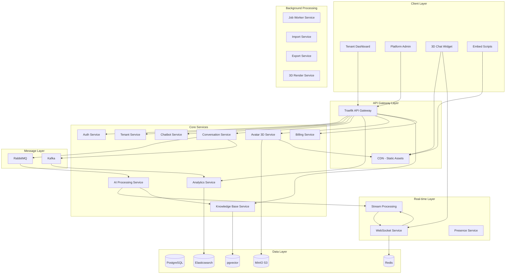

# Microservices Architecture - 3D Avatar Multi-Chatbot Platform

## Service Topology



## Service Definitions

### 1. Auth Service (Node.js + TypeScript)

**Port**: 3001  
**Responsibilities**:

- JWT token generation and validation
- OAuth2/SAML integration
- Multi-tenant user authentication
- API key management
- Session management via Redis

**Key Endpoints**:

```yaml
POST   /auth/login
POST   /auth/logout
POST   /auth/refresh
GET    /auth/validate
POST   /auth/api-keys
DELETE /auth/api-keys/{id}
```

### 2. Tenant Service (Node.js + TypeScript)

**Port**: 3002  
**Responsibilities**:

- Tenant provisioning and management
- Database isolation and routing
- Subscription management
- Tenant-specific configuration

**Key Endpoints**:

```yaml
POST   /tenants
GET    /tenants/{id}
PUT    /tenants/{id}
POST   /tenants/{id}/provision
PUT    /tenants/{id}/subscription
GET    /tenants/{id}/limits
```

### 3. Chatbot Service (Node.js + TypeScript)

**Port**: 3003  
**Responsibilities**:

- Multiple chatbot management per tenant
- Unique embed ID generation
- Avatar assignment
- Personality and behavior configuration
- Placement rules management
- Knowledge base association

**Key Endpoints**:

```yaml
GET    /tenants/{tenantId}/chatbots
POST   /tenants/{tenantId}/chatbots
GET    /chatbots/{id}
PUT    /chatbots/{id}
DELETE /chatbots/{id}
POST   /chatbots/{id}/avatar
PUT    /chatbots/{id}/personality
PUT    /chatbots/{id}/placement
GET    /chatbots/{id}/embed-script
GET    /embed/{embedId}/config
```

### 4. Conversation Service (Node.js + TypeScript)

**Port**: 3004  
**Responsibilities**:

- Conversation lifecycle management
- Message routing and storage
- Real-time message delivery
- Conversation history

**Key Endpoints**:

```yaml
POST   /conversations
GET    /conversations/{id}
POST   /conversations/{id}/messages
GET    /conversations/{id}/messages
PUT    /conversations/{id}/end
GET    /conversations/visitor/{visitorId}
```

### 5. AI Processing Service (Node.js + TypeScript)

**Port**: 3005  
**Responsibilities**:

- Multi-provider AI integration (OpenAI, Anthropic, Vertex)
- Streaming response generation
- Sentiment analysis for animation selection
- Knowledge base context injection
- Cost tracking per chatbot
- Response caching

**Key Endpoints**:

```yaml
POST   /ai/generate-response
POST   /ai/stream-response
POST   /ai/analyze-sentiment
POST   /ai/classify-intent
POST   /ai/select-animation
GET    /ai/providers
POST   /ai/knowledge/search
GET    /ai/costs/{chatbotId}
```

### 6. Analytics Service (Node.js + TypeScript)

**Port**: 3006  
**Responsibilities**:

- Event aggregation
- Metrics calculation
- Report generation
- Real-time dashboards

**Key Endpoints**:

```yaml
GET    /analytics/conversations/summary
GET    /analytics/chatbots/{id}/performance
GET    /analytics/visitors/insights
POST   /analytics/events
GET    /analytics/reports/generate
```

### 7. Avatar 3D Service (Node.js + TypeScript)

**Port**: 3007  
**Responsibilities**:

- 3D model management (.glb files)
- Animation library (~20 animations)
- Animation mapping to behaviors
- Model optimization and compression
- CDN asset delivery
- Preview generation

**Key Endpoints**:

```yaml
GET    /avatars
POST   /avatars/upload
GET    /avatars/{id}
GET    /avatars/{id}/animations
PUT    /avatars/{id}/animation-map
POST   /avatars/{id}/validate
GET    /avatars/{id}/preview
POST   /avatars/{id}/optimize
GET    /avatars/default
```

### 8. Knowledge Base Service (Node.js + TypeScript)

**Port**: 3010  
**Responsibilities**:

- Per-chatbot knowledge base management
- Document processing and chunking
- Vector embeddings generation
- Semantic search (RAG)
- Source tracking

**Key Endpoints**:

```yaml
POST   /knowledge-bases
GET    /knowledge-bases/{chatbotId}
POST   /knowledge-bases/{id}/documents
DELETE /knowledge-bases/{id}/documents/{docId}
POST   /knowledge-bases/{id}/search
POST   /knowledge-bases/{id}/embed
GET    /knowledge-bases/{id}/stats
```

### 9. WebSocket Service (Node.js + Socket.io)

**Port**: 3008  
**Responsibilities**:

- Real-time bidirectional communication
- Streaming AI responses
- Avatar state synchronization
- Connection management per chatbot
- Presence tracking

**Events**:

```yaml
connection
disconnect
message:send
message:receive
stream:start
stream:chunk
stream:end
avatar:animation
avatar:interaction
typing:start
typing:stop
conversation:end
```

### 9. Billing Service (Node.js + TypeScript)

**Port**: 3009  
**Responsibilities**:

- Subscription management
- Usage tracking
- Invoice generation
- Payment processing (Stripe integration)

**Key Endpoints**:

```yaml
POST   /billing/subscriptions
GET    /billing/subscriptions/{tenantId}
PUT    /billing/subscriptions/{id}/upgrade
POST   /billing/invoices/generate
GET    /billing/usage/{tenantId}
POST   /billing/webhooks/stripe
```

## Service Communication Patterns

### Synchronous Communication

```typescript
// HTTP Client with Circuit Breaker and Multi-Chatbot Support
class ServiceClient {
  constructor(
    private serviceName: string,
    private baseUrl: string,
    private circuitBreaker: CircuitBreaker
  ) {}

  async request<T>(options: RequestOptions): Promise<T> {
    return this.circuitBreaker.execute(async () => {
      const response = await fetch(`${this.baseUrl}${options.path}`, {
        method: options.method,
        headers: {
          'X-Tenant-ID': options.tenantId,
          'X-Chatbot-ID': options.chatbotId,
          'X-Request-ID': options.requestId,
          Authorization: options.token,
          'Content-Type': 'application/json',
        },
        body: options.body ? JSON.stringify(options.body) : undefined,
      })

      if (!response.ok) {
        throw new ServiceError(this.serviceName, response.status)
      }

      return response.json()
    })
  }
}
```

### Asynchronous Communication

```typescript
// RabbitMQ Message Publisher
class MessagePublisher {
  async publishEvent(event: DomainEvent): Promise<void> {
    const channel = await this.connection.createChannel()
    const exchange = `${event.aggregateType}.events`

    await channel.assertExchange(exchange, 'topic', { durable: true })

    channel.publish(
      exchange,
      event.eventType,
      Buffer.from(
        JSON.stringify({
          ...event,
          metadata: {
            ...event.metadata,
            publishedAt: new Date().toISOString(),
          },
        })
      ),
      {
        persistent: true,
        headers: {
          'x-tenant-id': event.metadata.tenantId,
        },
      }
    )
  }
}

// Event Consumer
class EventConsumer {
  async consume(queue: string, handler: EventHandler): Promise<void> {
    const channel = await this.connection.createChannel()
    await channel.assertQueue(queue, { durable: true })

    channel.consume(queue, async msg => {
      if (!msg) return

      try {
        const event = JSON.parse(msg.content.toString())
        await handler.handle(event)
        channel.ack(msg)
      } catch (error) {
        channel.nack(msg, false, true) // Requeue on error
      }
    })
  }
}
```

## Service Discovery & Health Checks

### Event-Driven Avatar Updates

```typescript
// Avatar Animation Event Publisher
class AvatarEventPublisher {
  async publishAnimationEvent(event: AnimationEvent): Promise<void> {
    const message = {
      chatbotId: event.chatbotId,
      conversationId: event.conversationId,
      animation: event.animation,
      duration: event.duration,
      sentiment: event.sentiment,
      timestamp: Date.now(),
    }

    // Publish to WebSocket for immediate update
    await this.websocketService.emit(`chatbot:${event.chatbotId}`, 'avatar:animation', message)

    // Log to analytics
    await this.kafka.send({
      topic: 'avatar-events',
      messages: [{ value: JSON.stringify(message) }],
    })
  }
}
```

## Service Discovery & Health Checks

```yaml
# Service Registration with Consul
services:
  - name: chatbot-service
    address: chatbot-service
    port: 3003
    tags: ['api', 'chatbot', 'multi-tenant']
    checks:
      - http: http://chatbot-service:3003/health
        interval: 10s
        timeout: 5s

  - name: avatar-service
    address: avatar-service
    port: 3007
    tags: ['api', 'avatar', '3d', 'cdn']
    checks:
      - http: http://avatar-service:3007/health
        interval: 10s
        timeout: 5s

  - name: knowledge-service
    address: knowledge-service
    port: 3010
    tags: ['api', 'knowledge', 'rag']
    checks:
      - http: http://knowledge-service:3010/health
        interval: 10s
        timeout: 5s
```

## Deployment Configuration

```yaml
# Kubernetes Deployment Example - Avatar Service
apiVersion: apps/v1
kind: Deployment
metadata:
  name: avatar-service
  namespace: saas-platform
spec:
  replicas: 2
  selector:
    matchLabels:
      app: avatar-service
  template:
    metadata:
      labels:
        app: avatar-service
    spec:
      containers:
        - name: avatar-service
          image: saas/avatar-service:latest
          ports:
            - containerPort: 3007
          env:
            - name: NODE_ENV
              value: 'production'
            - name: MINIO_ENDPOINT
              valueFrom:
                secretKeyRef:
                  name: minio-secret
                  key: endpoint
            - name: CDN_URL
              value: 'https://cdn.example.com'
          volumeMounts:
            - name: avatar-cache
              mountPath: /app/cache
          resources:
            requests:
              memory: '512Mi'
              cpu: '500m'
            limits:
              memory: '1Gi'
              cpu: '1000m'
      volumes:
        - name: avatar-cache
          emptyDir:
            sizeLimit: 5Gi
---
# WebSocket Service with Sticky Sessions
apiVersion: apps/v1
kind: Deployment
metadata:
  name: websocket-service
  namespace: saas-platform
spec:
  replicas: 3
  selector:
    matchLabels:
      app: websocket-service
  template:
    metadata:
      labels:
        app: websocket-service
    spec:
      containers:
        - name: websocket-service
          image: saas/websocket-service:latest
          ports:
            - containerPort: 3008
              name: websocket
          env:
            - name: NODE_ENV
              value: 'production'
            - name: REDIS_CLUSTER
              value: 'redis-cluster:6379'
            - name: STICKY_SESSIONS
              value: 'true'
          resources:
            requests:
              memory: '256Mi'
              cpu: '250m'
            limits:
              memory: '512Mi'
              cpu: '500m'
```

## Service Scaling Strategy

### Critical Services Scaling

```yaml
# Horizontal Pod Autoscaler
apiVersion: autoscaling/v2
kind: HorizontalPodAutoscaler
metadata:
  name: ai-service-hpa
  namespace: saas-platform
spec:
  scaleTargetRef:
    apiVersion: apps/v1
    kind: Deployment
    name: ai-service
  minReplicas: 2
  maxReplicas: 10
  metrics:
    - type: Resource
      resource:
        name: cpu
        target:
          type: Utilization
          averageUtilization: 70
    - type: Pods
      pods:
        metric:
          name: ai_queue_depth
        target:
          type: AverageValue
          averageValue: '30'
```

## Observability Stack

```yaml
# Custom Metrics for 3D Avatar Platform
receivers:
  otlp:
    protocols:
      grpc:
        endpoint: 0.0.0.0:4317
      http:
        endpoint: 0.0.0.0:4318

processors:
  batch:
    timeout: 1s
    send_batch_size: 1024

  attributes:
    actions:
      - key: environment
        value: production
        action: insert
      - key: service.namespace
        value: saas-platform
        action: insert
      - key: platform.component
        value: 3d-avatar-chatbot
        action: insert

  # Custom processor for chatbot metrics
  transform:
    metric_statements:
      - context: metric
        statements:
          - set(attributes["chatbot.id"], attributes["chatbot_id"])
          - set(attributes["tenant.id"], attributes["tenant_id"])
          - set(attributes["animation.name"], attributes["animation"])

exporters:
  prometheus:
    endpoint: '0.0.0.0:8889'
    namespace: avatar_platform

  jaeger:
    endpoint: jaeger-collector:14250
    tls:
      insecure: true

  elasticsearch:
    endpoints: ['http://elasticsearch:9200']
    index: 'avatar-platform-logs'

service:
  pipelines:
    traces:
      receivers: [otlp]
      processors: [batch, attributes]
      exporters: [jaeger]

    metrics:
      receivers: [otlp]
      processors: [batch, attributes, transform]
      exporters: [prometheus]

    logs:
      receivers: [otlp]
      processors: [batch, attributes]
      exporters: [elasticsearch]
```

## Performance Optimization

### CDN Configuration for 3D Assets

```nginx
# Nginx configuration for 3D model caching
server {
    listen 80;
    server_name cdn.avatarplatform.com;

    location /models/ {
        proxy_pass http://avatar-service:3007/models/;
        proxy_cache avatar_cache;
        proxy_cache_valid 200 7d;
        proxy_cache_key "$scheme$request_method$host$request_uri";

        # CORS for widget access
        add_header Access-Control-Allow-Origin *;
        add_header Cache-Control "public, max-age=604800";

        # Compression for GLB files
        gzip on;
        gzip_types model/gltf-binary;
    }

    location /animations/ {
        proxy_pass http://avatar-service:3007/animations/;
        proxy_cache animation_cache;
        proxy_cache_valid 200 7d;

        add_header Access-Control-Allow-Origin *;
        add_header Cache-Control "public, max-age=604800";
    }
}
```
