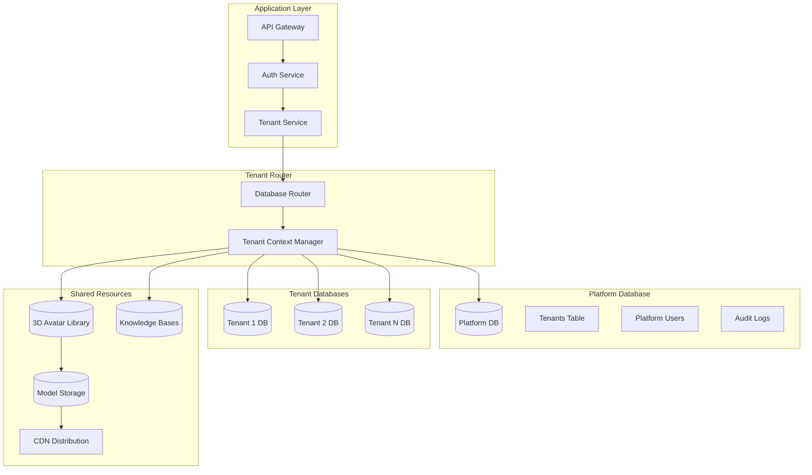

# Multi-Tenancy Data Strategy - 3D Avatar Multi-Chatbot Platform

## Overview

Our platform uses a **hybrid multi-tenancy approach** optimized for multiple chatbots per tenant:

- **Shared platform database** for tenant registry and system-wide data
- **Database-per-tenant isolation** for complete data segregation
- **Row-level security** for shared resources (3D avatars, templates)
- **Schema-based isolation** within tenant databases for chatbot separation
- **Dedicated storage namespaces** for 3D models and knowledge bases

## Architecture Diagram



## Database Isolation Strategy

### 1. Platform Database Structure

```sql
-- Platform database contains system-wide data
CREATE DATABASE platform_db;

-- Tenant registry with connection info and chatbot quotas
CREATE TABLE tenants (
    id UUID PRIMARY KEY,
    slug VARCHAR(63) UNIQUE NOT NULL,
    name VARCHAR(255) NOT NULL,
    database_name VARCHAR(63) UNIQUE NOT NULL,
    database_host VARCHAR(255) DEFAULT 'postgres',
    database_port INTEGER DEFAULT 5432,
    connection_pool_size INTEGER DEFAULT 20,
    status VARCHAR(50) DEFAULT 'active',
    subscription_plan VARCHAR(50) DEFAULT 'trial',
    chatbot_quota INTEGER DEFAULT 1,
    active_chatbots INTEGER DEFAULT 0,
    storage_quota_gb INTEGER DEFAULT 5,
    created_at TIMESTAMP DEFAULT CURRENT_TIMESTAMP,
    settings JSONB DEFAULT '{}'::jsonb
);

-- Shared avatar library
CREATE TABLE shared_avatars (
    id UUID PRIMARY KEY,
    name VARCHAR(255) NOT NULL,
    model_url TEXT NOT NULL,
    thumbnail_url TEXT,
    animations JSONB NOT NULL, -- List of ~20 animations
    is_premium BOOLEAN DEFAULT false,
    created_at TIMESTAMP DEFAULT CURRENT_TIMESTAMP
);

-- Connection pool configuration
CREATE TABLE tenant_connections (
    tenant_id UUID REFERENCES tenants(id),
    connection_string_encrypted TEXT NOT NULL,
    max_connections INTEGER DEFAULT 20,
    idle_timeout INTEGER DEFAULT 300,
    PRIMARY KEY (tenant_id)
);
```

### 2. Tenant Database Template

```sql
-- Template database for new tenants
CREATE DATABASE tenant_template_db;

-- Each tenant gets a copy of this schema
\c tenant_template_db;

-- Tenant-specific schemas
CREATE SCHEMA chatbot;
CREATE SCHEMA conversation;
CREATE SCHEMA analytics;
CREATE SCHEMA knowledge;

-- Chatbot table supporting multiple instances
CREATE TABLE chatbot.chatbots (
    id UUID PRIMARY KEY,
    embed_id VARCHAR(63) UNIQUE NOT NULL, -- For embed script
    name VARCHAR(255) NOT NULL,
    avatar_id UUID NOT NULL, -- References shared or custom avatar
    personality_config JSONB NOT NULL,
    knowledge_base_id UUID,
    placement_rules JSONB,
    animation_mappings JSONB, -- Custom animation triggers
    is_active BOOLEAN DEFAULT true,
    created_at TIMESTAMP DEFAULT CURRENT_TIMESTAMP
);

-- Conversation tracking per chatbot
CREATE TABLE conversation.conversations (
    id UUID PRIMARY KEY,
    chatbot_id UUID REFERENCES chatbot.chatbots(id),
    visitor_id VARCHAR(255) NOT NULL,
    started_at TIMESTAMP DEFAULT CURRENT_TIMESTAMP,
    ended_at TIMESTAMP,
    sentiment_score FLOAT,
    avatar_interactions INTEGER DEFAULT 0
);

-- Knowledge base per chatbot
CREATE TABLE knowledge.knowledge_bases (
    id UUID PRIMARY KEY,
    chatbot_id UUID REFERENCES chatbot.chatbots(id),
    name VARCHAR(255),
    vector_index_name VARCHAR(63) UNIQUE,
    document_count INTEGER DEFAULT 0,
    last_updated TIMESTAMP
);

-- Set default search path
ALTER DATABASE tenant_template_db SET search_path TO chatbot, conversation, analytics, knowledge, public;
```

### 3. Dynamic Tenant Provisioning

```typescript
// services/tenant-service/src/provisioning/database-provisioner.ts
export class DatabaseProvisioner {
  constructor(
    private platformDb: Pool,
    private adminDb: Client // Superuser connection
  ) {}

  async provisionTenant(tenant: TenantCreationRequest): Promise<TenantCredentials> {
    const dbName = this.generateDatabaseName(tenant.slug)
    const dbUser = `tenant_${tenant.slug}`
    const dbPassword = this.generateSecurePassword()

    try {
      // Start transaction
      await this.adminDb.query('BEGIN')

      // 1. Create database from template
      await this.adminDb.query(`
        CREATE DATABASE "${dbName}"
        WITH TEMPLATE tenant_template_db
        OWNER postgres
      `)

      // 2. Create dedicated user for tenant
      await this.adminDb.query(`
        CREATE USER "${dbUser}" WITH PASSWORD '${dbPassword}'
      `)

      // 3. Grant permissions
      await this.adminDb.query(`
        GRANT CONNECT ON DATABASE "${dbName}" TO "${dbUser}";
        GRANT CREATE ON DATABASE "${dbName}" TO "${dbUser}";
      `)

      // 4. Set row-level security
      await this.setupRowLevelSecurity(dbName, dbUser)

      // 5. Register in platform database
      const credentials = await this.registerTenant({
        ...tenant,
        databaseName: dbName,
        databaseUser: dbUser,
        databasePassword: dbPassword,
      })

      await this.adminDb.query('COMMIT')
      return credentials
    } catch (error) {
      await this.adminDb.query('ROLLBACK')
      throw new TenantProvisioningError(`Failed to provision tenant: ${error.message}`)
    }
  }

  private async setupRowLevelSecurity(dbName: string, dbUser: string): Promise<void> {
    const tenantDb = new Client({
      database: dbName,
      user: 'postgres',
      password: process.env.POSTGRES_ADMIN_PASSWORD,
    })

    await tenantDb.connect()

    try {
      // Enable RLS on sensitive tables across schemas
      const tablesWithSchemas = [
        'chatbot.chatbots',
        'conversation.conversations',
        'conversation.messages',
        'knowledge.knowledge_bases',
        'analytics.events',
      ]

      for (const tableWithSchema of tablesWithSchemas) {
        const [schema, table] = tableWithSchema.split('.')
        await tenantDb.query(`
          ALTER TABLE ${tableWithSchema} ENABLE ROW LEVEL SECURITY;

          CREATE POLICY ${table}_tenant_isolation ON ${tableWithSchema}
          FOR ALL TO "${dbUser}"
          USING (true)
          WITH CHECK (true);
        `)
      }

      // Create vector extension for knowledge bases
      await tenantDb.query(`CREATE EXTENSION IF NOT EXISTS vector;`)
    } finally {
      await tenantDb.end()
    }
  }
}
```

## Tenant Context Management

### 1. Request Context Middleware

```typescript
// middleware/tenant-context.ts
export interface TenantContext {
  tenantId: string
  tenantSlug: string
  databaseName: string
  userId?: string
  permissions: string[]
  chatbotId?: string // Current chatbot context
  chatbotQuota: number
  activeChatbots: number
}

export class TenantContextMiddleware {
  constructor(
    private tenantService: TenantService,
    private connectionManager: ConnectionManager
  ) {}

  async handle(req: Request, res: Response, next: NextFunction) {
    try {
      // Extract tenant from various sources
      const tenantIdentifier = this.extractTenantIdentifier(req)

      if (!tenantIdentifier) {
        throw new Error('Tenant identifier not found')
      }

      // Load tenant configuration
      const tenant = await this.tenantService.getTenant(tenantIdentifier)

      if (!tenant || tenant.status !== 'active') {
        throw new Error('Invalid or inactive tenant')
      }

      // Create tenant context with chatbot info
      const context: TenantContext = {
        tenantId: tenant.id,
        tenantSlug: tenant.slug,
        databaseName: tenant.databaseName,
        userId: req.user?.id,
        permissions: req.user?.permissions || [],
        chatbotId: this.extractChatbotId(req),
        chatbotQuota: tenant.chatbotQuota,
        activeChatbots: tenant.activeChatbots,
      }

      // Attach to request
      req.tenantContext = context

      // Set up database connection for this request
      const connection = await this.connectionManager.getConnection(tenant.id)
      req.tenantDb = connection

      next()
    } catch (error) {
      res.status(400).json({ error: 'Invalid tenant context' })
    }
  }

  private extractTenantIdentifier(req: Request): string | null {
    // 1. Check subdomain (e.g., acme.chatbot-saas.com)
    const subdomain = req.hostname.split('.')[0]
    if (subdomain && subdomain !== 'www' && subdomain !== 'api') {
      return subdomain
    }

    // 2. Check header (for API requests)
    const tenantHeader = req.headers['x-tenant-id'] || req.headers['x-tenant-slug']
    if (tenantHeader) {
      return tenantHeader as string
    }

    // 3. Check JWT token
    if (req.user?.tenantId) {
      return req.user.tenantId
    }

    // 4. Check API key
    const apiKey = req.headers['x-api-key']
    if (apiKey) {
      // API key contains tenant info
      return this.extractTenantFromApiKey(apiKey as string)
    }

    // 5. Check embed ID (for widget requests)
    const embedId = req.query.embedId || req.params.embedId
    if (embedId) {
      return this.extractTenantFromEmbedId(embedId as string)
    }

    return null
  }

  private extractChatbotId(req: Request): string | null {
    // From embed script requests
    if (req.params.embedId) {
      return this.getChatbotIdFromEmbedId(req.params.embedId)
    }

    // From API requests
    return (req.headers['x-chatbot-id'] as string) || null
  }
}
```

### 2. Connection Pool Management

```typescript
// services/connection-manager.ts
export class ConnectionManager {
  private pools: Map<string, Pool> = new Map()
  private poolConfig: PoolConfig = {
    min: 2,
    max: 20,
    idleTimeoutMillis: 30000,
    connectionTimeoutMillis: 2000,
  }

  constructor(private encryptionService: EncryptionService) {}

  async getConnection(tenantId: string): Promise<Pool> {
    // Check if pool exists
    if (this.pools.has(tenantId)) {
      const pool = this.pools.get(tenantId)!

      // Verify pool health
      try {
        await pool.query('SELECT 1')
        return pool
      } catch (error) {
        // Pool is unhealthy, recreate
        await this.removePool(tenantId)
      }
    }

    // Create new pool
    return this.createPool(tenantId)
  }

  private async createPool(tenantId: string): Promise<Pool> {
    // Get encrypted connection string from platform DB
    const result = await this.platformDb.query(
      `
      SELECT connection_string_encrypted, max_connections
      FROM tenant_connections
      WHERE tenant_id = $1
    `,
      [tenantId]
    )

    if (!result.rows[0]) {
      throw new Error(`No connection info found for tenant ${tenantId}`)
    }

    const connectionString = await this.encryptionService.decrypt(
      result.rows[0].connection_string_encrypted
    )

    const pool = new Pool({
      connectionString,
      ...this.poolConfig,
      max: result.rows[0].max_connections || this.poolConfig.max,
    })

    // Set up pool error handling
    pool.on('error', err => {
      console.error(`Pool error for tenant ${tenantId}:`, err)
      this.removePool(tenantId)
    })

    // Store pool
    this.pools.set(tenantId, pool)

    // Set up automatic cleanup
    this.schedulePoolCleanup(tenantId)

    return pool
  }

  private async removePool(tenantId: string): Promise<void> {
    const pool = this.pools.get(tenantId)
    if (pool) {
      await pool.end()
      this.pools.delete(tenantId)
    }
  }

  private schedulePoolCleanup(tenantId: string): void {
    // Remove idle pools after 1 hour
    setTimeout(async () => {
      const pool = this.pools.get(tenantId)
      if (pool && pool.idleCount === pool.totalCount) {
        await this.removePool(tenantId)
      }
    }, 3600000) // 1 hour
  }

  async shutdown(): Promise<void> {
    const promises = Array.from(this.pools.entries()).map(([tenantId, pool]) => {
      return pool.end()
    })
    await Promise.all(promises)
    this.pools.clear()
  }
}
```

### 3. Repository Pattern with Tenant Context

```typescript
// repositories/base-tenant-repository.ts
export abstract class BaseTenantRepository<T> {
  constructor(protected connectionManager: ConnectionManager) {}

  protected async query(
    context: TenantContext,
    text: string,
    values?: any[]
  ): Promise<QueryResult> {
    const pool = await this.connectionManager.getConnection(context.tenantId)
    return pool.query(text, values)
  }

  protected async transaction<R>(
    context: TenantContext,
    callback: (client: PoolClient) => Promise<R>
  ): Promise<R> {
    const pool = await this.connectionManager.getConnection(context.tenantId)
    const client = await pool.connect()

    try {
      await client.query('BEGIN')
      const result = await callback(client)
      await client.query('COMMIT')
      return result
    } catch (error) {
      await client.query('ROLLBACK')
      throw error
    } finally {
      client.release()
    }
  }
}

// Example implementation for multi-chatbot support
export class ChatbotRepository extends BaseTenantRepository<Chatbot> {
  async findById(context: TenantContext, id: string): Promise<Chatbot | null> {
    const result = await this.query(context, 'SELECT * FROM chatbot.chatbots WHERE id = $1', [id])

    return result.rows[0] ? this.mapToChatbot(result.rows[0]) : null
  }

  async findByEmbedId(context: TenantContext, embedId: string): Promise<Chatbot | null> {
    const result = await this.query(
      context,
      'SELECT * FROM chatbot.chatbots WHERE embed_id = $1 AND is_active = true',
      [embedId]
    )

    return result.rows[0] ? this.mapToChatbot(result.rows[0]) : null
  }

  async findAllByTenant(context: TenantContext): Promise<Chatbot[]> {
    const result = await this.query(
      context,
      'SELECT * FROM chatbot.chatbots WHERE is_active = true ORDER BY created_at DESC'
    )

    return result.rows.map(row => this.mapToChatbot(row))
  }

  async create(context: TenantContext, chatbot: CreateChatbotDto): Promise<Chatbot> {
    // Check quota
    if (context.activeChatbots >= context.chatbotQuota) {
      throw new QuotaExceededError('Chatbot quota exceeded')
    }

    return this.transaction(context, async client => {
      // Generate unique embed ID
      const embedId = this.generateEmbedId()

      const result = await client.query(
        `
        INSERT INTO chatbot.chatbots (
          embed_id, name, avatar_id, personality_config,
          knowledge_base_id, placement_rules, animation_mappings
        )
        VALUES ($1, $2, $3, $4, $5, $6, $7)
        RETURNING *
      `,
        [
          embedId,
          chatbot.name,
          chatbot.avatarId,
          chatbot.personalityConfig,
          chatbot.knowledgeBaseId,
          chatbot.placementRules,
          chatbot.animationMappings,
        ]
      )

      // Update tenant's active chatbot count
      await this.updateTenantChatbotCount(context.tenantId, 1)

      // Create knowledge base
      if (!chatbot.knowledgeBaseId) {
        await this.createKnowledgeBase(client, result.rows[0].id)
      }

      // Generate embed script
      await this.generateEmbedScript(embedId, result.rows[0])

      return this.mapToChatbot(result.rows[0])
    })
  }

  private generateEmbedId(): string {
    return `cb_${nanoid(12)}` // cb_abc123def456
  }
}
```

## Data Migration & Backup Strategy

### 1. Tenant Data Migration

```typescript
// services/tenant-migration-service.ts
export class TenantMigrationService {
  async migrateTenant(
    sourceTenantId: string,
    targetEnvironment: 'staging' | 'production'
  ): Promise<MigrationResult> {
    const sourceContext = await this.getContext(sourceTenantId)
    const targetDb = await this.provisionTargetDatabase(sourceContext, targetEnvironment)

    try {
      // 1. Export schema and data
      const dump = await this.exportTenantData(sourceContext)

      // 2. Import to target
      await this.importTenantData(targetDb, dump)

      // 3. Verify data integrity
      await this.verifyMigration(sourceContext, targetDb)

      // 4. Update routing
      await this.updateTenantRouting(sourceTenantId, targetDb)

      return { success: true, targetDatabase: targetDb.name }
    } catch (error) {
      await this.rollbackMigration(targetDb)
      throw error
    }
  }

  private async exportTenantData(context: TenantContext): Promise<Buffer> {
    const pgDump = spawn('pg_dump', [
      '-h',
      context.host,
      '-U',
      context.username,
      '-d',
      context.databaseName,
      '--no-owner',
      '--no-acl',
      '--format=custom',
      '--verbose',
    ])

    const chunks: Buffer[] = []
    pgDump.stdout.on('data', chunk => chunks.push(chunk))

    return new Promise((resolve, reject) => {
      pgDump.on('exit', code => {
        if (code === 0) {
          resolve(Buffer.concat(chunks))
        } else {
          reject(new Error(`pg_dump exited with code ${code}`))
        }
      })
    })
  }
}
```

### 2. Multi-Chatbot Storage Strategy

```typescript
// services/storage-manager.ts
export class MultiChatbotStorageManager {
  constructor(
    private s3: S3Client,
    private cdnService: CDNService
  ) {}

  // Organize storage by tenant and chatbot
  private getStoragePath(
    tenantId: string,
    chatbotId: string,
    type: 'avatar' | 'knowledge' | 'analytics'
  ): string {
    return `tenants/${tenantId}/chatbots/${chatbotId}/${type}/`
  }

  async uploadAvatarModel(
    tenantId: string,
    chatbotId: string,
    file: Buffer,
    filename: string
  ): Promise<string> {
    const path = this.getStoragePath(tenantId, chatbotId, 'avatar') + filename

    // Upload to S3
    await this.s3.putObject({
      Bucket: process.env.S3_BUCKET!,
      Key: path,
      Body: file,
      ContentType: 'model/gltf-binary',
      CacheControl: 'public, max-age=31536000', // 1 year
    })

    // Distribute via CDN
    const cdnUrl = await this.cdnService.distribute(path)

    return cdnUrl
  }

  async getStorageUsage(tenantId: string): Promise<StorageUsage> {
    const objects = await this.s3.listObjectsV2({
      Bucket: process.env.S3_BUCKET!,
      Prefix: `tenants/${tenantId}/`,
    })

    const usage: StorageUsage = {
      totalSizeBytes: 0,
      byType: {
        avatars: 0,
        knowledge: 0,
        analytics: 0,
      },
      byChatbot: new Map(),
    }

    for (const object of objects.Contents || []) {
      usage.totalSizeBytes += object.Size || 0

      // Parse path to categorize usage
      const parts = object.Key!.split('/')
      if (parts.length >= 5) {
        const chatbotId = parts[3]
        const type = parts[4] as keyof typeof usage.byType

        usage.byType[type] += object.Size || 0

        const chatbotUsage = usage.byChatbot.get(chatbotId) || 0
        usage.byChatbot.set(chatbotId, chatbotUsage + (object.Size || 0))
      }
    }

    return usage
  }
}
```

### 3. Automated Backup Strategy

```yaml
# kubernetes/cronjob-tenant-backup.yaml
apiVersion: batch/v1
kind: CronJob
metadata:
  name: tenant-backup
spec:
  schedule: '0 3 * * *' # Daily at 3 AM
  jobTemplate:
    spec:
      template:
        spec:
          containers:
            - name: backup
              image: saas/tenant-backup:latest
              env:
                - name: S3_BUCKET
                  value: tenant-backups
                - name: RETENTION_DAYS
                  value: '30'
              command:
                - /bin/sh
                - -c
                - |
                  # Get all active tenants
                  TENANTS=$(psql -h $PLATFORM_DB_HOST -U postgres -d platform_db -t -c \
                    "SELECT id, database_name FROM tenants WHERE status = 'active'")

                  # Backup each tenant
                  while IFS='|' read -r TENANT_ID TENANT_DB; do
                    echo "Backing up $TENANT_DB"

                    # Create database backup
                    pg_dump -h $TENANT_DB_HOST -U postgres -d $TENANT_DB \
                      --format=custom --verbose \
                      -f /tmp/$TENANT_DB-$(date +%Y%m%d-%H%M%S).dump

                    # Backup vector embeddings
                    pg_dump -h $TENANT_DB_HOST -U postgres -d $TENANT_DB \
                      --table='knowledge.embeddings' \
                      --format=custom \
                      -f /tmp/$TENANT_DB-vectors-$(date +%Y%m%d-%H%M%S).dump
                    
                    # Backup S3 assets metadata
                    aws s3 sync \
                      s3://$S3_BUCKET/tenants/$TENANT_ID/ \
                      s3://$S3_BUCKET-backup/$(date +%Y/%m/%d)/tenants/$TENANT_ID/ \
                      --storage-class GLACIER_IR

                    # Upload database backups to S3
                    aws s3 cp /tmp/$TENANT_DB-*.dump \
                      s3://$S3_BUCKET-backup/$(date +%Y/%m/%d)/databases/ \
                      --storage-class GLACIER_IR

                    # Clean up
                    rm /tmp/$TENANT_DB-*.dump
                  done <<< "$TENANTS"

                  # Remove old backups
                  aws s3 ls s3://$S3_BUCKET/ --recursive | \
                    awk '{print $4}' | \
                    while read KEY; do
                      CREATE_DATE=$(aws s3api head-object \
                        --bucket $S3_BUCKET --key $KEY \
                        --query LastModified --output text)

                      if [ $(date -d "$CREATE_DATE" +%s) -lt \
                           $(date -d "$RETENTION_DAYS days ago" +%s) ]; then
                        aws s3 rm s3://$S3_BUCKET/$KEY
                      fi
                    done
          restartPolicy: OnFailure
```

## Performance Optimization

### 1. Query Routing

```typescript
// services/query-router.ts
export class QueryRouter {
  constructor(
    private readReplicas: Map<string, Pool>,
    private writeNodes: Map<string, Pool>
  ) {}

  async executeQuery(
    context: TenantContext,
    query: string,
    params: any[],
    options: { readonly?: boolean } = {}
  ): Promise<QueryResult> {
    const pool = options.readonly
      ? this.getReadReplica(context.tenantId)
      : this.getWriteNode(context.tenantId)

    return pool.query(query, params)
  }

  private getReadReplica(tenantId: string): Pool {
    // Round-robin between read replicas
    const replicas = this.readReplicas.get(tenantId) || []
    const index = this.roundRobinIndex.get(tenantId) || 0

    const replica = replicas[index % replicas.length]
    this.roundRobinIndex.set(tenantId, index + 1)

    return replica
  }
}
```

### 2. Multi-Level Caching Strategy

```typescript
// services/multi-chatbot-cache.ts
export class MultiChatbotCacheService {
  private cacheKeyPrefix = {
    tenant: (tenantId: string) => `tenant:${tenantId}:`,
    chatbot: (tenantId: string, chatbotId: string) => `tenant:${tenantId}:chatbot:${chatbotId}:`,
    avatar: (avatarId: string) => `avatar:${avatarId}:`,
    knowledge: (knowledgeBaseId: string) => `kb:${knowledgeBaseId}:`,
  }

  constructor(private redis: Redis) {}

  // Chatbot-specific caching
  async getChatbotData<T>(tenantId: string, chatbotId: string, key: string): Promise<T | null> {
    const fullKey = this.cacheKeyPrefix.chatbot(tenantId, chatbotId) + key
    const value = await this.redis.get(fullKey)
    return value ? JSON.parse(value) : null
  }

  async setChatbotData<T>(
    tenantId: string,
    chatbotId: string,
    key: string,
    value: T,
    ttl: number = 3600
  ): Promise<void> {
    const fullKey = this.cacheKeyPrefix.chatbot(tenantId, chatbotId) + key
    await this.redis.setex(fullKey, ttl, JSON.stringify(value))
  }

  // Avatar caching (shared across tenants)
  async getAvatarData(avatarId: string): Promise<AvatarCache | null> {
    const key = this.cacheKeyPrefix.avatar(avatarId) + 'data'
    const cached = await this.redis.get(key)
    return cached ? JSON.parse(cached) : null
  }

  async setAvatarData(avatarId: string, data: AvatarCache): Promise<void> {
    const key = this.cacheKeyPrefix.avatar(avatarId) + 'data'
    // Avatar data cached for 24 hours
    await this.redis.setex(key, 86400, JSON.stringify(data))
  }

  // Knowledge base caching
  async getCachedEmbeddings(
    knowledgeBaseId: string,
    query: string
  ): Promise<EmbeddingResult[] | null> {
    const queryHash = this.hashQuery(query)
    const key = this.cacheKeyPrefix.knowledge(knowledgeBaseId) + queryHash
    const cached = await this.redis.get(key)
    return cached ? JSON.parse(cached) : null
  }

  async setCachedEmbeddings(
    knowledgeBaseId: string,
    query: string,
    results: EmbeddingResult[]
  ): Promise<void> {
    const queryHash = this.hashQuery(query)
    const key = this.cacheKeyPrefix.knowledge(knowledgeBaseId) + queryHash
    // Cache for 1 hour
    await this.redis.setex(key, 3600, JSON.stringify(results))
  }

  async invalidateChatbot(tenantId: string, chatbotId: string): Promise<void> {
    const pattern = this.cacheKeyPrefix.chatbot(tenantId, chatbotId) + '*'
    const keys = await this.redis.keys(pattern)

    if (keys.length > 0) {
      await this.redis.del(...keys)
    }
  }

  private hashQuery(query: string): string {
    return crypto.createHash('sha256').update(query).digest('hex').substring(0, 16)
  }
}

interface AvatarCache {
  modelUrl: string
  animations: string[]
  fileSize: number
  optimizedUrl?: string
}

interface EmbeddingResult {
  documentId: string
  content: string
  score: number
  metadata: Record<string, any>
}
```
