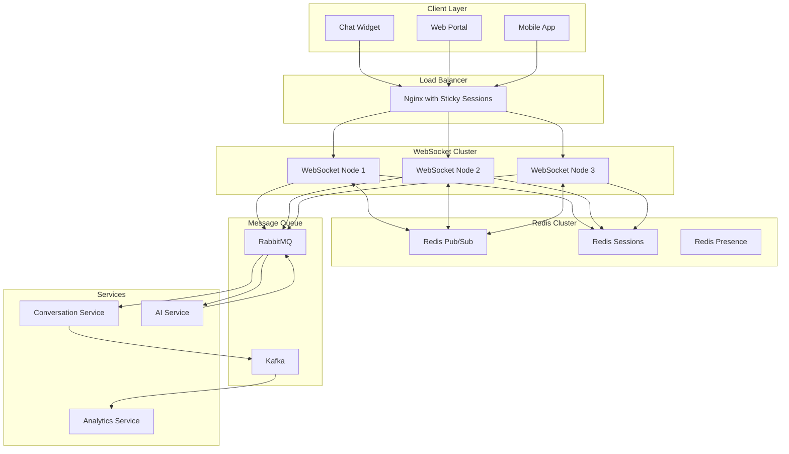

# Real-Time Chat Infrastructure

## Architecture Overview



## WebSocket Service Implementation

### Socket.io Configuration with Redis Adapter

```typescript
// websocket-service/src/server.ts
import { Server } from "socket.io";
import { createAdapter } from "@socket.io/redis-adapter";
import { Cluster } from "@socket.io/cluster-adapter";
import { setupWorker } from "@socket.io/sticky";
import Redis from "ioredis";

// Redis clients for pub/sub
const pubClient = new Redis({
  host: process.env.REDIS_HOST,
  port: parseInt(process.env.REDIS_PORT || "6379"),
  password: process.env.REDIS_PASSWORD,
  db: 0, // Pub/Sub DB
});

const subClient = pubClient.duplicate();

// Session store
const sessionStore = new Redis({
  host: process.env.REDIS_HOST,
  port: parseInt(process.env.REDIS_PORT || "6379"),
  password: process.env.REDIS_PASSWORD,
  db: 1, // Sessions DB
});

// Presence store
const presenceStore = new Redis({
  host: process.env.REDIS_HOST,
  port: parseInt(process.env.REDIS_PORT || "6379"),
  password: process.env.REDIS_PASSWORD,
  db: 2, // Presence DB
});

export function createWebSocketServer(httpServer: any) {
  const io = new Server(httpServer, {
    cors: {
      origin: process.env.ALLOWED_ORIGINS?.split(",") || [
        "http://localhost:3000",
      ],
      credentials: true,
    },
    transports: ["websocket", "polling"],
    pingTimeout: 60000,
    pingInterval: 25000,
  });

  // Redis adapter for horizontal scaling
  io.adapter(createAdapter(pubClient, subClient));

  // Sticky sessions setup for clustering
  if (process.env.NODE_ENV === "production") {
    setupWorker(io);
  }

  return io;
}
```

### Connection Management

```typescript
// websocket-service/src/handlers/connection-handler.ts
interface SocketData {
  tenantId: string;
  chatbotId: string;
  conversationId?: string;
  visitorId: string;
  userId?: string; // For authenticated users
}

export class ConnectionHandler {
  constructor(
    private io: Server,
    private sessionStore: Redis,
    private presenceStore: Redis,
    private messageQueue: MessageQueue,
  ) {}

  async handleConnection(socket: Socket) {
    const { deploymentKey, visitorId } = socket.handshake.auth;

    try {
      // Validate deployment key and get chatbot info
      const chatbot = await this.validateDeploymentKey(deploymentKey);

      // Create or restore session
      const session = await this.createOrRestoreSession(socket, {
        tenantId: chatbot.tenantId,
        chatbotId: chatbot.id,
        visitorId,
      });

      // Join tenant and conversation rooms
      socket.join(`tenant:${chatbot.tenantId}`);
      socket.join(`visitor:${visitorId}`);

      if (session.conversationId) {
        socket.join(`conversation:${session.conversationId}`);
      }

      // Update presence
      await this.updatePresence(visitorId, "online");

      // Setup event handlers
      this.setupEventHandlers(socket, session);

      // Send connection acknowledgment
      socket.emit("connected", {
        sessionId: session.id,
        conversationId: session.conversationId,
        chatbot: {
          id: chatbot.id,
          name: chatbot.name,
          avatar: chatbot.avatarConfig,
          welcomeMessage: chatbot.welcomeMessage,
        },
      });
    } catch (error) {
      socket.emit("error", { message: "Invalid deployment key" });
      socket.disconnect();
    }
  }

  private setupEventHandlers(socket: Socket, session: SessionData) {
    // Message handling
    socket.on("message:send", async (data) => {
      await this.handleMessage(socket, session, data);
    });

    // Typing indicators
    socket.on("typing:start", async () => {
      socket.to(`conversation:${session.conversationId}`).emit("typing:start", {
        visitorId: session.visitorId,
      });
    });

    socket.on("typing:stop", async () => {
      socket.to(`conversation:${session.conversationId}`).emit("typing:stop", {
        visitorId: session.visitorId,
      });
    });

    // Disconnect handling
    socket.on("disconnect", async () => {
      await this.handleDisconnect(socket, session);
    });
  }

  private async handleMessage(
    socket: Socket,
    session: SessionData,
    data: { content: string; metadata?: any },
  ) {
    try {
      // Create message event
      const messageEvent = {
        conversationId: session.conversationId,
        visitorId: session.visitorId,
        content: data.content,
        metadata: data.metadata,
        timestamp: new Date(),
      };

      // Emit to conversation participants
      this.io
        .to(`conversation:${session.conversationId}`)
        .emit("message:received", {
          id: generateId(),
          ...messageEvent,
          sender: "visitor",
        });

      // Queue for processing
      await this.messageQueue.publish("conversation.message.received", {
        ...messageEvent,
        tenantId: session.tenantId,
        chatbotId: session.chatbotId,
      });
    } catch (error) {
      socket.emit("error", { message: "Failed to send message" });
    }
  }
}
```

### Message Processing Pipeline

```typescript
// websocket-service/src/queues/message-processor.ts
export class MessageProcessor {
  constructor(
    private rabbitMQ: RabbitMQConnection,
    private io: Server,
  ) {}

  async setupQueues() {
    const channel = await this.rabbitMQ.createChannel();

    // Incoming messages queue
    await channel.assertQueue("messages.incoming", {
      durable: true,
      arguments: {
        "x-message-ttl": 300000, // 5 minutes TTL
        "x-max-priority": 10,
      },
    });

    // AI responses queue
    await channel.assertQueue("messages.ai-responses", {
      durable: true,
    });

    // Dead letter queue for failed messages
    await channel.assertQueue("messages.dlq", {
      durable: true,
      arguments: {
        "x-message-ttl": 86400000, // 24 hours
      },
    });

    // Bind queues to exchange
    await channel.assertExchange("conversations", "topic", { durable: true });
    await channel.bindQueue(
      "messages.incoming",
      "conversations",
      "message.received",
    );
    await channel.bindQueue(
      "messages.ai-responses",
      "conversations",
      "response.generated",
    );
  }

  async processIncomingMessage(message: IncomingMessage) {
    const channel = await this.rabbitMQ.createChannel();

    try {
      // Add to conversation history
      await this.conversationService.addMessage(message);

      // Send to AI processing with priority
      await channel.publish(
        "ai-processing",
        "process.message",
        Buffer.from(JSON.stringify(message)),
        {
          priority: this.calculatePriority(message),
          headers: {
            "x-tenant-id": message.tenantId,
            "x-retry-count": 0,
          },
        },
      );
    } catch (error) {
      // Send to DLQ on failure
      await channel.publish(
        "messages",
        "dlq",
        Buffer.from(JSON.stringify(message)),
        {
          headers: {
            "x-error": error.message,
            "x-original-routing-key": "message.received",
          },
        },
      );
    }
  }

  async processAIResponse(response: AIResponse) {
    try {
      // Store in conversation
      await this.conversationService.addMessage({
        conversationId: response.conversationId,
        content: response.content,
        sender: "bot",
        metadata: {
          intent: response.intent,
          confidence: response.confidence,
          processingTime: response.processingTime,
        },
      });

      // Send via WebSocket
      this.io
        .to(`conversation:${response.conversationId}`)
        .emit("message:received", {
          id: response.messageId,
          conversationId: response.conversationId,
          content: response.content,
          sender: "bot",
          timestamp: new Date(),
          metadata: {
            intent: response.intent,
            suggested_actions: response.suggestedActions,
          },
        });

      // Update analytics
      await this.publishAnalyticsEvent({
        type: "message.sent",
        conversationId: response.conversationId,
        responseTime: response.processingTime,
        intent: response.intent,
      });
    } catch (error) {
      console.error("Failed to process AI response:", error);
    }
  }
}
```

### Presence Management

```typescript
// websocket-service/src/services/presence-service.ts
export class PresenceService {
  private readonly PRESENCE_TTL = 300; // 5 minutes

  constructor(private redis: Redis) {}

  async setUserPresence(
    visitorId: string,
    status: "online" | "away" | "offline",
    metadata?: any,
  ): Promise<void> {
    const key = `presence:${visitorId}`;
    const data = {
      status,
      lastSeen: new Date().toISOString(),
      ...metadata,
    };

    await this.redis.setex(key, this.PRESENCE_TTL, JSON.stringify(data));

    // Publish presence update
    await this.redis.publish(
      "presence:updates",
      JSON.stringify({
        visitorId,
        ...data,
      }),
    );
  }

  async getUserPresence(visitorId: string): Promise<PresenceData | null> {
    const data = await this.redis.get(`presence:${visitorId}`);
    return data ? JSON.parse(data) : null;
  }

  async getActiveVisitors(tenantId: string): Promise<string[]> {
    const pattern = `presence:*`;
    const keys = await this.redis.keys(pattern);

    const activeVisitors = [];
    for (const key of keys) {
      const data = await this.redis.get(key);
      if (data) {
        const presence = JSON.parse(data);
        if (presence.tenantId === tenantId && presence.status === "online") {
          activeVisitors.push(key.replace("presence:", ""));
        }
      }
    }

    return activeVisitors;
  }

  async heartbeat(visitorId: string): Promise<void> {
    const key = `presence:${visitorId}`;
    await this.redis.expire(key, this.PRESENCE_TTL);
  }
}
```

### Scaling Strategy

```yaml
# kubernetes/websocket-deployment.yaml
apiVersion: apps/v1
kind: Deployment
metadata:
  name: websocket-service
spec:
  replicas: 3
  selector:
    matchLabels:
      app: websocket-service
  template:
    metadata:
      labels:
        app: websocket-service
    spec:
      containers:
        - name: websocket
          image: saas/websocket-service:latest
          ports:
            - containerPort: 3008
              name: websocket
          env:
            - name: STICKY_SESSION
              value: "true"
            - name: WORKER_COUNT
              value: "4"
          resources:
            requests:
              memory: "512Mi"
              cpu: "500m"
            limits:
              memory: "1Gi"
              cpu: "1000m"
          readinessProbe:
            httpGet:
              path: /health
              port: 3008
            initialDelaySeconds: 10
            periodSeconds: 5
          livenessProbe:
            httpGet:
              path: /health
              port: 3008
            initialDelaySeconds: 30
            periodSeconds: 10
---
apiVersion: v1
kind: Service
metadata:
  name: websocket-service
spec:
  type: ClusterIP
  sessionAffinity: ClientIP
  sessionAffinityConfig:
    clientIP:
      timeoutSeconds: 10800
  ports:
    - port: 3008
      targetPort: 3008
      name: websocket
  selector:
    app: websocket-service
---
apiVersion: autoscaling/v2
kind: HorizontalPodAutoscaler
metadata:
  name: websocket-hpa
spec:
  scaleTargetRef:
    apiVersion: apps/v1
    kind: Deployment
    name: websocket-service
  minReplicas: 3
  maxReplicas: 20
  metrics:
    - type: Resource
      resource:
        name: cpu
        target:
          type: Utilization
          averageUtilization: 70
    - type: Resource
      resource:
        name: memory
        target:
          type: Utilization
          averageUtilization: 80
    - type: Pods
      pods:
        metric:
          name: websocket_connections_per_pod
        target:
          type: AverageValue
          averageValue: "1000"
```

### Client SDK

```typescript
// client-sdk/src/chatbot-client.ts
export class ChatbotClient {
  private socket: Socket;
  private reconnectAttempts = 0;
  private maxReconnectAttempts = 5;

  constructor(
    private deploymentKey: string,
    private options: ChatbotClientOptions = {},
  ) {}

  async connect(): Promise<void> {
    const visitorId = this.getOrCreateVisitorId();

    this.socket = io(this.options.serverUrl || "https://api.chatbot-saas.com", {
      auth: {
        deploymentKey: this.deploymentKey,
        visitorId,
      },
      transports: ["websocket", "polling"],
      reconnection: true,
      reconnectionDelay: 1000,
      reconnectionDelayMax: 5000,
      reconnectionAttempts: this.maxReconnectAttempts,
    });

    this.setupEventHandlers();

    return new Promise((resolve, reject) => {
      this.socket.on("connected", (data) => {
        this.onConnected(data);
        resolve();
      });

      this.socket.on("error", (error) => {
        reject(error);
      });
    });
  }

  sendMessage(content: string, metadata?: any): void {
    this.socket.emit("message:send", {
      content,
      metadata,
      timestamp: new Date().toISOString(),
    });
  }

  onMessage(callback: (message: Message) => void): void {
    this.socket.on("message:received", callback);
  }

  startTyping(): void {
    this.socket.emit("typing:start");
  }

  stopTyping(): void {
    this.socket.emit("typing:stop");
  }

  disconnect(): void {
    this.socket.disconnect();
  }

  private setupEventHandlers(): void {
    this.socket.on("reconnect", (attemptNumber) => {
      console.log(`Reconnected after ${attemptNumber} attempts`);
      this.reconnectAttempts = 0;
    });

    this.socket.on("reconnect_attempt", () => {
      this.reconnectAttempts++;
    });

    this.socket.on("reconnect_error", (error) => {
      console.error("Reconnection error:", error);
    });

    this.socket.on("reconnect_failed", () => {
      console.error("Failed to reconnect after maximum attempts");
      this.onReconnectFailed();
    });
  }

  private getOrCreateVisitorId(): string {
    const key = "chatbot_visitor_id";
    let visitorId = localStorage.getItem(key);

    if (!visitorId) {
      visitorId = `visitor_${Date.now()}_${Math.random().toString(36).substr(2, 9)}`;
      localStorage.setItem(key, visitorId);
    }

    return visitorId;
  }
}
```
