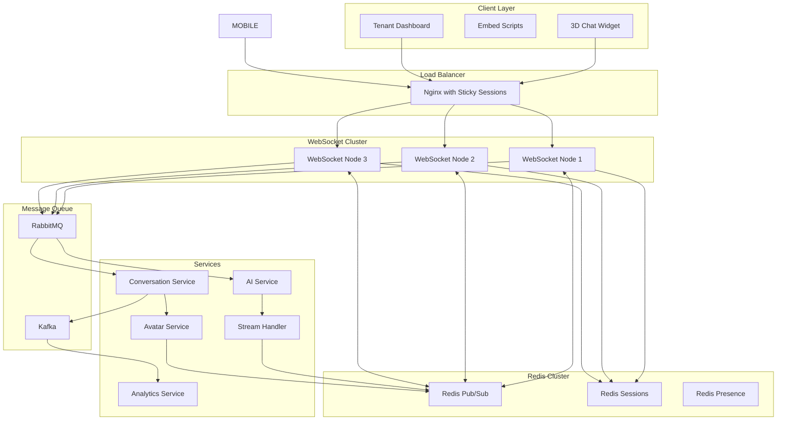

# Real-Time 3D Avatar Chat Infrastructure

## Architecture Overview

Supporting real-time communication with synchronized 3D avatar animations and streaming AI responses.



## WebSocket Service Implementation

### Socket.io Configuration with Redis Adapter

```typescript
// websocket-service/src/server.ts
import { Server } from 'socket.io'
import { createAdapter } from '@socket.io/redis-adapter'
import { Cluster } from '@socket.io/cluster-adapter'
import { setupWorker } from '@socket.io/sticky'
import Redis from 'ioredis'

// Redis clients for pub/sub
const pubClient = new Redis({
  host: process.env.REDIS_HOST,
  port: parseInt(process.env.REDIS_PORT || '6379'),
  password: process.env.REDIS_PASSWORD,
  db: 0, // Pub/Sub DB
})

const subClient = pubClient.duplicate()

// Session store
const sessionStore = new Redis({
  host: process.env.REDIS_HOST,
  port: parseInt(process.env.REDIS_PORT || '6379'),
  password: process.env.REDIS_PASSWORD,
  db: 1, // Sessions DB
})

// Presence store
const presenceStore = new Redis({
  host: process.env.REDIS_HOST,
  port: parseInt(process.env.REDIS_PORT || '6379'),
  password: process.env.REDIS_PASSWORD,
  db: 2, // Presence DB
})

export function createWebSocketServer(httpServer: any) {
  const io = new Server(httpServer, {
    cors: {
      origin: process.env.ALLOWED_ORIGINS?.split(',') || ['http://localhost:3000'],
      credentials: true,
    },
    transports: ['websocket', 'polling'],
    pingTimeout: 60000,
    pingInterval: 25000,
  })

  // Redis adapter for horizontal scaling
  io.adapter(createAdapter(pubClient, subClient))

  // Sticky sessions setup for clustering
  if (process.env.NODE_ENV === 'production') {
    setupWorker(io)
  }

  return io
}
```

### Connection Management

```typescript
// websocket-service/src/handlers/connection-handler.ts
interface SocketData {
  tenantId: string
  chatbotId: string
  embedId: string
  conversationId?: string
  visitorId: string
  userId?: string // For authenticated users
  avatarState?: AvatarState
}

interface AvatarState {
  currentAnimation: string
  position: { x: number; y: number; z: number }
  rotation: { x: number; y: number; z: number }
  lastInteraction: Date
}

export class ConnectionHandler {
  constructor(
    private io: Server,
    private sessionStore: Redis,
    private presenceStore: Redis,
    private messageQueue: MessageQueue
  ) {}

  async handleConnection(socket: Socket) {
    const { embedId, visitorId } = socket.handshake.auth

    try {
      // Validate embed ID and get chatbot info
      const chatbot = await this.validateEmbedId(embedId)

      // Create or restore session
      const session = await this.createOrRestoreSession(socket, {
        tenantId: chatbot.tenantId,
        chatbotId: chatbot.id,
        embedId,
        visitorId,
        avatarState: {
          currentAnimation: 'idle',
          position: { x: 0, y: 0, z: 0 },
          rotation: { x: 0, y: 0, z: 0 },
          lastInteraction: new Date(),
        },
      })

      // Join rooms
      socket.join(`tenant:${chatbot.tenantId}`)
      socket.join(`chatbot:${chatbot.id}`)
      socket.join(`visitor:${visitorId}`)

      if (session.conversationId) {
        socket.join(`conversation:${session.conversationId}`)
      }

      // Update presence
      await this.updatePresence(visitorId, 'online', { chatbotId: chatbot.id })

      // Setup event handlers
      this.setupEventHandlers(socket, session)

      // Send connection acknowledgment with avatar data
      socket.emit('connected', {
        sessionId: session.id,
        conversationId: session.conversationId,
        chatbot: {
          id: chatbot.id,
          name: chatbot.name,
          embedId: chatbot.embedId,
          avatar: {
            modelUrl: chatbot.avatarModelUrl,
            animations: chatbot.animationMap,
            initialAnimation: 'wave',
          },
          personality: chatbot.personality,
          welcomeMessage: chatbot.welcomeMessage,
        },
      })

      // Trigger welcome animation
      socket.emit('avatar:animate', {
        animation: 'wave',
        duration: 2000,
      })
    } catch (error) {
      socket.emit('error', { message: 'Invalid embed ID' })
      socket.disconnect()
    }
  }

  private setupEventHandlers(socket: Socket, session: SessionData) {
    // Message handling
    socket.on('message:send', async data => {
      await this.handleMessage(socket, session, data)
    })

    // Typing indicators
    socket.on('typing:start', async () => {
      socket.to(`conversation:${session.conversationId}`).emit('typing:start', {
        visitorId: session.visitorId,
      })
      // Avatar thinking animation
      socket.emit('avatar:animate', { animation: 'thinking', loop: true })
    })

    socket.on('typing:stop', async () => {
      socket.to(`conversation:${session.conversationId}`).emit('typing:stop', {
        visitorId: session.visitorId,
      })
      // Back to idle
      socket.emit('avatar:animate', { animation: 'idle', loop: true })
    })

    // Avatar interactions
    socket.on('avatar:interact', async data => {
      await this.handleAvatarInteraction(socket, session, data)
    })

    // Avatar state sync
    socket.on('avatar:state', async state => {
      session.avatarState = state
      await this.updateAvatarState(session.conversationId, state)
    })

    // Disconnect handling
    socket.on('disconnect', async () => {
      await this.handleDisconnect(socket, session)
    })
  }

  private async handleAvatarInteraction(
    socket: Socket,
    session: SessionData,
    interaction: AvatarInteraction
  ) {
    const animationMap = {
      click: ['wave', 'nod', 'happy'],
      hover: ['look_at_camera', 'smile'],
      drag: ['surprised', 'thinking'],
    }

    const animations = animationMap[interaction.type] || ['idle']
    const selectedAnimation = animations[Math.floor(Math.random() * animations.length)]

    // Emit animation to user
    socket.emit('avatar:animate', {
      animation: selectedAnimation,
      duration: 2000,
    })

    // Track interaction
    await this.analyticsService.trackInteraction({
      conversationId: session.conversationId,
      chatbotId: session.chatbotId,
      interactionType: interaction.type,
      animation: selectedAnimation,
    })
  }

  private async handleMessage(
    socket: Socket,
    session: SessionData,
    data: { content: string; metadata?: any }
  ) {
    try {
      // Create message event
      const messageEvent = {
        conversationId: session.conversationId,
        visitorId: session.visitorId,
        content: data.content,
        metadata: data.metadata,
        timestamp: new Date(),
      }

      // Emit to conversation participants
      this.io.to(`conversation:${session.conversationId}`).emit('message:received', {
        id: generateId(),
        ...messageEvent,
        sender: 'visitor',
      })

      // Queue for processing
      await this.messageQueue.publish('conversation.message.received', {
        ...messageEvent,
        tenantId: session.tenantId,
        chatbotId: session.chatbotId,
      })
    } catch (error) {
      socket.emit('error', { message: 'Failed to send message' })
    }
  }
}
```

### Message Processing Pipeline

```typescript
// websocket-service/src/queues/message-processor.ts
export class MessageProcessor {
  constructor(
    private rabbitMQ: RabbitMQConnection,
    private io: Server
  ) {}

  async setupQueues() {
    const channel = await this.rabbitMQ.createChannel()

    // Incoming messages queue
    await channel.assertQueue('messages.incoming', {
      durable: true,
      arguments: {
        'x-message-ttl': 300000, // 5 minutes TTL
        'x-max-priority': 10,
      },
    })

    // AI responses queue
    await channel.assertQueue('messages.ai-responses', {
      durable: true,
    })

    // Dead letter queue for failed messages
    await channel.assertQueue('messages.dlq', {
      durable: true,
      arguments: {
        'x-message-ttl': 86400000, // 24 hours
      },
    })

    // Bind queues to exchange
    await channel.assertExchange('conversations', 'topic', { durable: true })
    await channel.bindQueue('messages.incoming', 'conversations', 'message.received')
    await channel.bindQueue('messages.ai-responses', 'conversations', 'response.generated')
  }

  async processIncomingMessage(message: IncomingMessage) {
    const channel = await this.rabbitMQ.createChannel()

    try {
      // Add to conversation history
      await this.conversationService.addMessage(message)

      // Send to AI processing with priority
      await channel.publish(
        'ai-processing',
        'process.message',
        Buffer.from(JSON.stringify(message)),
        {
          priority: this.calculatePriority(message),
          headers: {
            'x-tenant-id': message.tenantId,
            'x-retry-count': 0,
          },
        }
      )
    } catch (error) {
      // Send to DLQ on failure
      await channel.publish('messages', 'dlq', Buffer.from(JSON.stringify(message)), {
        headers: {
          'x-error': error.message,
          'x-original-routing-key': 'message.received',
        },
      })
    }
  }

  async processAIResponse(response: AIResponse) {
    try {
      // Store in conversation
      await this.conversationService.addMessage({
        conversationId: response.conversationId,
        content: response.content,
        sender: 'bot',
        metadata: {
          intent: response.intent,
          confidence: response.confidence,
          processingTime: response.processingTime,
          sentiment: response.sentiment,
          animation: response.selectedAnimation,
        },
      })

      // Send via WebSocket with avatar animation
      this.io.to(`conversation:${response.conversationId}`).emit('message:received', {
        id: response.messageId,
        conversationId: response.conversationId,
        content: response.content,
        sender: 'bot',
        timestamp: new Date(),
        metadata: {
          intent: response.intent,
          suggested_actions: response.suggestedActions,
        },
        avatar: {
          animation: response.selectedAnimation,
          duration: response.animationDuration,
          sentiment: response.sentiment,
        },
      })

      // Trigger avatar animation
      this.io.to(`conversation:${response.conversationId}`).emit('avatar:animate', {
        animation: response.selectedAnimation,
        duration: response.animationDuration,
        sentiment: response.sentiment,
      })

      // Update analytics
      await this.publishAnalyticsEvent({
        type: 'message.sent',
        conversationId: response.conversationId,
        responseTime: response.processingTime,
        intent: response.intent,
        animation: response.selectedAnimation,
      })
    } catch (error) {
      console.error('Failed to process AI response:', error)
    }
  }
}
```

### Presence Management

```typescript
// websocket-service/src/services/presence-service.ts
export class PresenceService {
  private readonly PRESENCE_TTL = 300 // 5 minutes

  constructor(private redis: Redis) {}

  async setUserPresence(
    visitorId: string,
    status: 'online' | 'away' | 'offline',
    metadata?: any
  ): Promise<void> {
    const key = `presence:${visitorId}`
    const data = {
      status,
      lastSeen: new Date().toISOString(),
      ...metadata,
    }

    await this.redis.setex(key, this.PRESENCE_TTL, JSON.stringify(data))

    // Publish presence update
    await this.redis.publish(
      'presence:updates',
      JSON.stringify({
        visitorId,
        ...data,
      })
    )
  }

  async getUserPresence(visitorId: string): Promise<PresenceData | null> {
    const data = await this.redis.get(`presence:${visitorId}`)
    return data ? JSON.parse(data) : null
  }

  async getActiveVisitors(tenantId: string): Promise<string[]> {
    const pattern = `presence:*`
    const keys = await this.redis.keys(pattern)

    const activeVisitors = []
    for (const key of keys) {
      const data = await this.redis.get(key)
      if (data) {
        const presence = JSON.parse(data)
        if (presence.tenantId === tenantId && presence.status === 'online') {
          activeVisitors.push(key.replace('presence:', ''))
        }
      }
    }

    return activeVisitors
  }

  async heartbeat(visitorId: string): Promise<void> {
    const key = `presence:${visitorId}`
    await this.redis.expire(key, this.PRESENCE_TTL)
  }
}
```

### Scaling Strategy

```yaml
# kubernetes/websocket-deployment.yaml
apiVersion: apps/v1
kind: Deployment
metadata:
  name: websocket-service
spec:
  replicas: 3
  selector:
    matchLabels:
      app: websocket-service
  template:
    metadata:
      labels:
        app: websocket-service
    spec:
      containers:
        - name: websocket
          image: saas/websocket-service:latest
          ports:
            - containerPort: 3008
              name: websocket
          env:
            - name: STICKY_SESSION
              value: 'true'
            - name: WORKER_COUNT
              value: '4'
          resources:
            requests:
              memory: '512Mi'
              cpu: '500m'
            limits:
              memory: '1Gi'
              cpu: '1000m'
          readinessProbe:
            httpGet:
              path: /health
              port: 3008
            initialDelaySeconds: 10
            periodSeconds: 5
          livenessProbe:
            httpGet:
              path: /health
              port: 3008
            initialDelaySeconds: 30
            periodSeconds: 10
---
apiVersion: v1
kind: Service
metadata:
  name: websocket-service
spec:
  type: ClusterIP
  sessionAffinity: ClientIP
  sessionAffinityConfig:
    clientIP:
      timeoutSeconds: 10800
  ports:
    - port: 3008
      targetPort: 3008
      name: websocket
  selector:
    app: websocket-service
---
apiVersion: autoscaling/v2
kind: HorizontalPodAutoscaler
metadata:
  name: websocket-hpa
spec:
  scaleTargetRef:
    apiVersion: apps/v1
    kind: Deployment
    name: websocket-service
  minReplicas: 3
  maxReplicas: 20
  metrics:
    - type: Resource
      resource:
        name: cpu
        target:
          type: Utilization
          averageUtilization: 70
    - type: Resource
      resource:
        name: memory
        target:
          type: Utilization
          averageUtilization: 80
    - type: Pods
      pods:
        metric:
          name: websocket_connections_per_pod
        target:
          type: AverageValue
          averageValue: '1000'
```

### Streaming AI Response Handler

```typescript
// websocket-service/src/streaming/stream-handler.ts
export class StreamingResponseHandler {
  constructor(
    private io: Server,
    private avatarService: AvatarService
  ) {}

  async handleStreamingResponse(
    conversationId: string,
    chatbotId: string,
    stream: AsyncIterable<string>
  ) {
    const streamId = generateStreamId()
    let fullContent = ''
    let chunkCount = 0

    // Notify clients stream is starting
    this.io.to(`conversation:${conversationId}`).emit('stream:start', {
      streamId,
      conversationId,
      timestamp: new Date(),
    })

    // Start talking animation
    this.io.to(`conversation:${conversationId}`).emit('avatar:animate', {
      animation: 'talk_calm',
      loop: true,
    })

    try {
      // Process stream chunks
      for await (const chunk of stream) {
        fullContent += chunk
        chunkCount++

        // Send chunk to clients
        this.io.to(`conversation:${conversationId}`).emit('stream:chunk', {
          streamId,
          chunk,
          chunkIndex: chunkCount,
        })

        // Alternate talking animations for naturalness
        if (chunkCount % 10 === 0) {
          const talkingAnimations = ['talk_calm', 'talk_explain', 'talk_gesture']
          const animation = talkingAnimations[chunkCount % talkingAnimations.length]

          this.io.to(`conversation:${conversationId}`).emit('avatar:animate', {
            animation,
            loop: true,
          })
        }

        // Rate limiting
        if (chunkCount % 5 === 0) {
          await new Promise(resolve => setTimeout(resolve, 50))
        }
      }

      // Analyze complete response for final animation
      const sentiment = await this.analyzeSentiment(fullContent)
      const finalAnimation = this.selectFinalAnimation(sentiment)

      // Stream complete
      this.io.to(`conversation:${conversationId}`).emit('stream:complete', {
        streamId,
        totalChunks: chunkCount,
        sentiment,
        finalAnimation,
      })

      // Play final animation
      this.io.to(`conversation:${conversationId}`).emit('avatar:animate', {
        animation: finalAnimation,
        duration: 3000,
      })

      // Store complete message
      await this.storeStreamedMessage({
        conversationId,
        chatbotId,
        content: fullContent,
        sentiment,
        animation: finalAnimation,
        streamId,
        chunkCount,
      })
    } catch (error) {
      // Stream error
      this.io.to(`conversation:${conversationId}`).emit('stream:error', {
        streamId,
        error: 'Stream interrupted',
      })

      // Error animation
      this.io.to(`conversation:${conversationId}`).emit('avatar:animate', {
        animation: 'confused',
        duration: 2000,
      })

      throw error
    }
  }

  private selectFinalAnimation(sentiment: SentimentScore): string {
    if (sentiment.value > 0.5) return 'happy'
    if (sentiment.value < -0.5) return 'concerned'
    if (sentiment.confidence < 0.5) return 'thinking'
    return 'nod'
  }
}
```

### Client SDK with 3D Avatar Support

```typescript
// client-sdk/src/avatar-chatbot-client.ts
export class AvatarChatbotClient {
  private socket: Socket
  private avatarController: AvatarController
  private streamBuffer: string = ''
  private isStreaming: boolean = false

  constructor(
    private embedId: string,
    private container: HTMLElement,
    private options: AvatarChatbotOptions = {}
  ) {
    this.initializeAvatar()
  }

  private async initializeAvatar() {
    // Load Three.js and avatar controller
    this.avatarController = new AvatarController(this.container)
    await this.avatarController.initialize()
  }

  async connect(): Promise<void> {
    const visitorId = this.getOrCreateVisitorId()

    this.socket = io(this.options.serverUrl || 'https://api.avatarchat.com', {
      auth: {
        embedId: this.embedId,
        visitorId,
      },
      transports: ['websocket', 'polling'],
      reconnection: true,
      reconnectionDelay: 1000,
      reconnectionDelayMax: 5000,
    })

    this.setupEventHandlers()

    return new Promise((resolve, reject) => {
      this.socket.on('connected', async data => {
        await this.onConnected(data)
        resolve()
      })

      this.socket.on('error', error => {
        reject(error)
      })
    })
  }

  private async onConnected(data: ConnectionData) {
    // Load 3D avatar model
    await this.avatarController.loadModel(data.chatbot.avatar.modelUrl)

    // Setup animations
    this.avatarController.setupAnimations(data.chatbot.avatar.animations)

    // Play initial animation
    await this.avatarController.playAnimation(data.chatbot.avatar.initialAnimation)

    // Setup interaction handlers
    this.setupAvatarInteractions()
  }

  private setupEventHandlers(): void {
    // Avatar animations
    this.socket.on('avatar:animate', async data => {
      await this.avatarController.playAnimation(data.animation, {
        duration: data.duration,
        loop: data.loop,
      })
    })

    // Streaming responses
    this.socket.on('stream:start', data => {
      this.isStreaming = true
      this.streamBuffer = ''
      this.onStreamStart?.(data)
    })

    this.socket.on('stream:chunk', data => {
      this.streamBuffer += data.chunk
      this.onStreamChunk?.(data.chunk, this.streamBuffer)
    })

    this.socket.on('stream:complete', async data => {
      this.isStreaming = false
      this.onStreamComplete?.(this.streamBuffer, data)

      // Play final animation
      if (data.finalAnimation) {
        await this.avatarController.playAnimation(data.finalAnimation)
      }
    })

    // Standard message handling
    this.socket.on('message:received', async message => {
      this.onMessage?.(message)

      // Play animation if provided
      if (message.avatar?.animation) {
        await this.avatarController.playAnimation(message.avatar.animation, {
          duration: message.avatar.duration,
        })
      }
    })
  }

  private setupAvatarInteractions(): void {
    // Click handler
    this.avatarController.on('click', event => {
      this.socket.emit('avatar:interact', {
        type: 'click',
        position: event.position,
      })
    })

    // Hover handler
    this.avatarController.on('hover', event => {
      this.socket.emit('avatar:interact', {
        type: 'hover',
        position: event.position,
      })
    })

    // Drag handler
    this.avatarController.on('drag', event => {
      this.socket.emit('avatar:interact', {
        type: 'drag',
        position: event.position,
        delta: event.delta,
      })
    })
  }

  sendMessage(content: string, metadata?: any): void {
    this.socket.emit('message:send', {
      content,
      metadata,
      timestamp: new Date().toISOString(),
    })

    // Play thinking animation while waiting for response
    this.avatarController.playAnimation('thinking', { loop: true })
  }

  private setupEventHandlers(): void {
    this.socket.on('reconnect', attemptNumber => {
      console.log(`Reconnected after ${attemptNumber} attempts`)
      this.reconnectAttempts = 0
    })

    this.socket.on('reconnect_attempt', () => {
      this.reconnectAttempts++
    })

    this.socket.on('reconnect_error', error => {
      console.error('Reconnection error:', error)
    })

    this.socket.on('reconnect_failed', () => {
      console.error('Failed to reconnect after maximum attempts')
      this.onReconnectFailed()
    })
  }

  private getOrCreateVisitorId(): string {
    const key = `avatar_chatbot_visitor_${this.embedId}`
    let visitorId = localStorage.getItem(key)

    if (!visitorId) {
      visitorId = `visitor_${Date.now()}_${Math.random().toString(36).substr(2, 9)}`
      localStorage.setItem(key, visitorId)
    }

    return visitorId
  }
}

// Avatar controller for Three.js integration
class AvatarController extends EventEmitter {
  private scene: THREE.Scene
  private renderer: THREE.WebGLRenderer
  private camera: THREE.PerspectiveCamera
  private mixer: THREE.AnimationMixer
  private model: THREE.Object3D
  private animations: Map<string, THREE.AnimationAction> = new Map()

  constructor(private container: HTMLElement) {
    super()
    this.initializeScene()
  }

  async loadModel(url: string): Promise<void> {
    const loader = new GLTFLoader()
    const gltf = await loader.loadAsync(url)

    this.model = gltf.scene
    this.scene.add(this.model)

    // Setup animation mixer
    this.mixer = new THREE.AnimationMixer(this.model)

    // Extract animations
    gltf.animations.forEach(clip => {
      const action = this.mixer.clipAction(clip)
      this.animations.set(clip.name, action)
    })
  }

  async playAnimation(name: string, options: AnimationOptions = {}): Promise<void> {
    const action = this.animations.get(name)
    if (!action) return

    // Stop current animations
    this.animations.forEach(a => a.stop())

    // Play new animation
    action.reset()
    action.setLoop(options.loop ? THREE.LoopRepeat : THREE.LoopOnce)
    action.play()

    if (options.duration && !options.loop) {
      setTimeout(() => {
        action.fadeOut(0.5)
        this.playAnimation('idle', { loop: true })
      }, options.duration)
    }
  }
}
```
